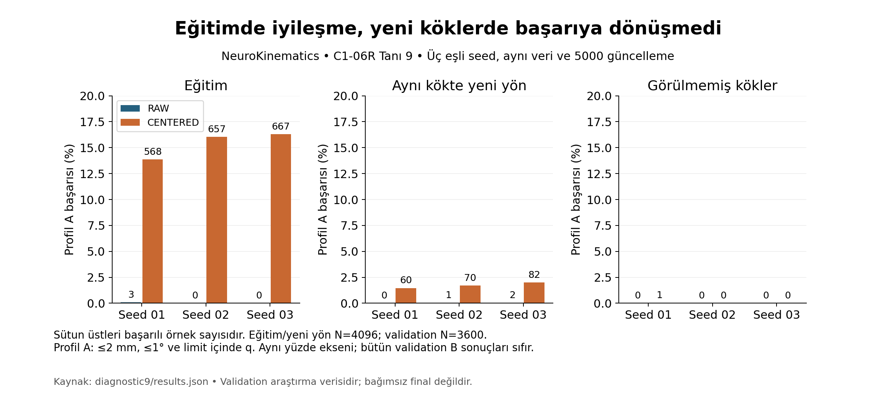

# NeuroKinematics

NeuroKinematics, robot manipülatörleri için ters kinematiği (IK) ölçülebilir ve yeniden üretilebilir biçimde inceleyen bir araştırma-yazılım projesidir. Uzun vadeli hedef, güvenilir sayısal çözümü gerektiğinde öğrenilmiş başlangıçlarla destekleyen hibrit bir sistemdir. Depo doğrulanmış kinematik altyapısını, baseline karşılaştırmalarını, eğitim hattını ve negatif araştırma sonuçlarını içerir.

**Durum (11 Ekim 2026): Foundations/G0 ve Core/G1 araştırma kapanışları PASS / ACCEPTED. Doğrudan neural IK ürün hedefi karşılanmadı; H2 reddedildi. Hybrid başlamadı.** [G1 kararı](experiments/C1-07/G1_DECISION.md), [nihai model kartı](experiments/C1-07/MODEL_CARD.md) ve [projeye dönüş rehberi](docs/records/CORE_RESUME.md) güncel durumu gösterir. G1 araştırma kabulüdür; ürün başarısı veya fiziksel robot güvenlik onayı değildir. Hedef v1.0.0 için release/tag oluşturulmadı.

## Core'dan çıkan sonuç

- Beş sayısal baseline aynı dondurulmuş iş yükünde 600000 ölçüm kaydıyla doğrulandı.
- Özgün C1-06'da 21 neural checkpoint'in her biri 12000 sorguda Profil A/B sıfır başarı verdi. H2 sonucu REJECTED.
- C1-06R uzun eğitim ve sonraki kontrollü tanılar hedefe ulaştıramadı. Son üç-seed CENTERED deneyinde eğitim başarısı artsa da validation A sonuçları 1/3600, 0/3600, 0/3600; B sonuçları sıfır kaldı. Validation bağımsız final değildir.
- T-C06 temiz kaynak kopyası ve yeni kilitli ortamda 127 test geçti; altı checkpoint × 48 sorgunun 288 çıktısı ve bağımsız FK metrikleri birebir eşleşti.
- Ana üç FK_TANH ve keşifsel local-only üç RAW modeli, ileride H1 neural başlangıç deneyinde sınanmak üzere kimlikleriyle devredildi. Hibrit fayda henüz ölçülmedi.

[Akademik negatif sonuç raporu (PDF)](docs/publication/core/Core_Negatif_Sonuc_Raporu.pdf) · [Kaynak metin](docs/research/C1-06_NEGATIVE_RESULTS.md) · [LinkedIn taslağı ve görseller](docs/publication/core/LINKEDIN.md)



## Dört faz

| Faz | Hedef | Kapsam | Güncel durum |
|---|---|---|---|
| [Foundations](docs/roadmaps/F0_Foundations.md) | v0.1.0 · G0 | Robot kimliği, bağımsız/referans FK, Jacobian, deterministik veri ve DLS benchmark | ✅ **Tamamlandı** · F0-00–F0-06 ve G0 PASS |
| [Core](docs/roadmaps/C1_Core.md) | v1.0.0 · G1 | Harici baseline'lar, durumla şartlandırılmış veri, diferansiyellenebilir FK, neural modeller ve ablasyon | ✅ **Araştırma tamamlandı** · G1 PASS; ürün NOT_MET / direct IK NO_GO |
| [Hybrid](docs/roadmaps/H2_Hybrid.md) | v2.0.0 · G2 | Bütçeli hibrit çözüm, öğrenilmiş başlangıç deneyi, yörünge ve ONNX eşliği | ◻️ Başlamadı · G1 sağlandı; sıradaki görev H2-01 |
| [Studio](docs/roadmaps/S3_Studio.md) | v3.0.0 · G3 | İkinci robot, masaüstü arayüz, analiz, paketleme ve kullanıcı testi | ◻️ Planlandı · G2'ye bağlı |

Bu hedef sürümler roadmap adlarıdır; mevcut yazılımın dört sürümünün yayımlandığı iddiası değildir. [Ana roadmap](docs/roadmaps/MASTER_ROADMAP.md), [durum kaydı](docs/records/STATUS.md) ve [izlenebilirlik](docs/TRACEABILITY.md) görev düzeyindeki kayıtlardır.

## Foundations'da gerçekten yapılanlar

- Exact kaynak commit ve SHA-256 zinciriyle KUKA KR 6 R900 sixx modelinin altı döner eklemi, `base_link`–`tool0` koordinat sözleşmesi ve robot manifesti doğrulandı.
- Bağımsız NumPy FK, Pinocchio referansıyla **10.000** konfigürasyonda karşılaştırıldı: maksimum konum farkı **4,751 × 10⁻¹⁶ m**, dönme matrisi Frobenius farkı **9,160 × 10⁻¹⁶**; iki kabul sınırı da `1e-9` idi.
- Geometrik, Pinocchio ve merkezi-fark Jacobian'ları **256 rastgele + 21 seçilmiş** konfigürasyonda, üç perturbasyon büyüklüğünde karşılaştırıldı. Ana `h=1e-6 rad` maksimum normalize fark **1,768 × 10⁻¹⁰** (`≤1e-5`).
- Deterministik veri fabrikasında **10.000 ana + 1.000 eklem sınırı + 1.000 tekillik yakınlığı** kaydı oluşturuldu; grup bazlı split, train-only normalizasyon ve tekrarlı üretim denetlendi.
- Sabit sönümlemeli DLS için **12.000 bağımsız sorgu** üzerinde 10/50 ms ve beşer tekrar ile **120.000 ölçüm satırı** üretildi. Sıkı Profil B'nin 50 ms deadline başarı oranı **%68,627**; geniş başlangıçlarda daha düşüktür. Bu, üstünlük veya gerçek-zaman garantisi değil, ölçülen baseline'dır.
- F0-06 temiz Windows ortamında **497 regresyon testi + 26 kapanış testi** geçti; iki bağımsız küçük uçtan uca üretim aynı veri/query hashlerini verdi. [Kanıt indeksi](experiments/F0-06/FOUNDATIONS_EVIDENCE_INDEX.md) ve [Core devir paketi](experiments/F0-06/CORE_HANDOFF.md) hazır.

## Kurulum ve yeniden üretim

Kanonik Foundations ve T-C06 doğrulama platformu **native Windows 11 x64**, Pixi **0.81.0**; Python **3.12.14**, Pinocchio **4.1.0**, NumPy **2.5.3** kilitlidir. Core T-C06, hashli **Torch 2.10.0+cu128** overlay kullanır. C1-01 sayısal baselinelar Ubuntu/ROS Docker ortamında çalıştırıldı; bu, neural T-C06 için Linux doğrulaması değildir. [Kurulum rehberi](docs/SETUP.md) Foundations kurulumunu; [CORE_RESUME](docs/records/CORE_RESUME.md) Core ortamını ve temiz replay komutlarını açıklar.

```powershell
pixi install --locked
pixi lock --check
pixi run --locked env-check
pixi run --locked verify-robot-a
pixi run --locked test-f02
pixi run --locked test-f03
pixi run --locked test-f04
```

F0-05 tam benchmarkı daha maliyetlidir; kayıtlı üretim komutları ve dışarıda tutulan büyük dosyaların durumunu [F0-05 çalışma kaydından](experiments/F0-05/RUN_REPORT.md) kontrol edin. F0-06 temiz ortam yeniden üretimi, **yeni ve boş** hedefler gerektirir; tam komut [F0-06 COMMANDS](experiments/F0-06/COMMANDS.md) içindedir. Mevcut kanıt dosyalarının üzerine gelişigüzel yeniden koşu yapmayın.

## Bilimsel ve güvenlik sınırı

FK/Jacobian farklarının makine duyarlılığına yakın olması **fiziksel robotun o doğrulukta olduğu** anlamına gelmez; iki uygulama aynı URDF'yi kullanır. Kapsama ölçümleri ampirik grid doluluğudur, tüm erişilebilir uzayın garantisi değildir. Collision checking, kalibrasyon, fiziksel robot deneyi ve güvenlik doğrulaması yapılmadı. Hybrid, ONNX ve GUI sonraki fazlardadır. Sayısal solver başarısızlığı hedefin erişilemezliğinin kanıtı sayılmaz.

Büyük veri ve model ağırlıkları normal Git takibinde değildir. 607 dosyalık yerel arşivin oluşturma ve geri yükleme kanıtları C1-07 closure klasöründedir; ikinci aygıt/uzak arşiv **NOT_CONFIRMED**. Git clone tek başına checkpointleri sağlamaz. Kod ve belge hazırlığında yapay zekâ desteği kullanılmıştır; bilimsel katkı ve yorum sınırları negatif sonuç raporundadır.

## Belgeler

- [Foundations uygulama ve sonuç raporu](docs/raporlar/01_Foundations_v0_1_sonuc_r2.md) — yöntem, ölçümler, grafik, tehditler ve kanıtlar.
- [Özgün Foundations tasarım raporu (r1)](docs/raporlar/01_Foundations_v0_1_r1.md) — tarihsel, uygulama öncesi plan; sonuç belgesi değildir.
- [Neuro ana plan](docs/raporlar/00_Neuro_Ana_Plan_r1.md), [dört faz roadmap'i](docs/roadmaps/MASTER_ROADMAP.md), [güncel durum](docs/records/STATUS.md).
- [G0 kararı](experiments/F0-06/G0_DECISION.md), [kanıt indeksi](experiments/F0-06/FOUNDATIONS_EVIDENCE_INDEX.json), [Core devri](experiments/F0-06/CORE_HANDOFF.md).
- [Depo çalışma kuralları](AGENTS.md), [kurulum](docs/SETUP.md), [kaynak rapor arşivi](archive/).

Kaynak DOCX'ler ve eski plan revizyonları tarihsel bağlamlarıyla korunur. Güncel Core durumu G1 kararı ve tarihli çalışma kayıtlarıyla izlenir.
