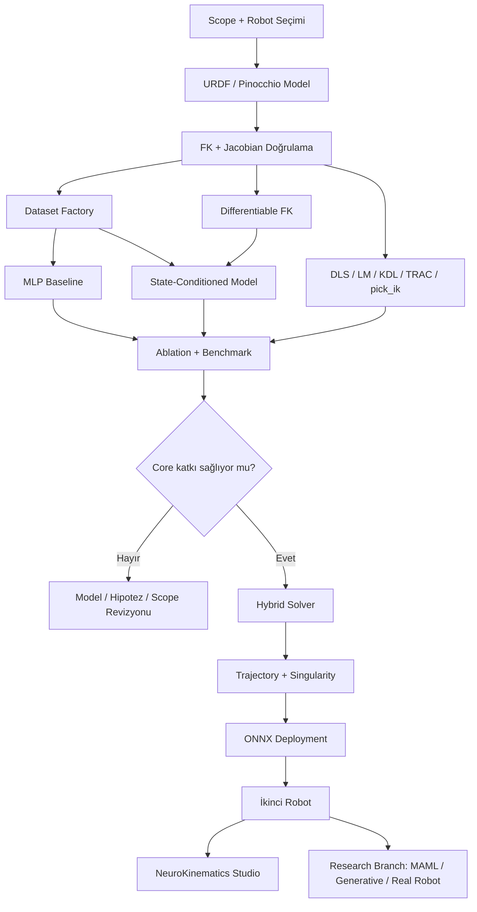
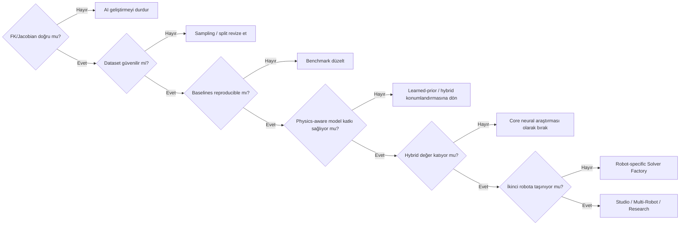

# NeuroKinematics Projesi: Tam Teknik İnceleme, Puanlama ve Revize Uygulama Roadmap’i

## Yönetici özeti

10 Ağustos 2026 tarihli **126 sayfalık NeuroKinematics proje dokümanını**, bölüm yapısından teorik kinematik altyapısına, veri mühendisliğinden yapay zekâ mimarisine, benchmark tasarımından GUI/ürünleştirme, risk yönetimi ve gelecek vizyonuna kadar bütün olarak inceledim. Dosyanın mevcut hali, sıradan bir öğrenci “AI ile ters kinematik yaptım” projesinin oldukça üzerinde; doküman aslında aynı anda **araştırma projesi + robotik yazılım kütüphanesi + benchmark altyapısı + masaüstü mühendislik uygulaması + potansiyel ürün** olmaya çalışıyor. fileciteturn0file0

Benim ana kararım şu:

> **Projeyi iptal etmem. Kesinlikle uygularım. Fakat mevcut 126 sayfalık vizyonu tek sürüm olarak uygulamaya çalışmam.**

Mevcut haliyle proje için **konsensüs puanım 67/100**. Bunun nedeni fikrin zayıf olması değil; tam tersine fikrin ve dokümanın bir öğrenci projesi için **fazla geniş** olmasıdır. En güçlü tarafı portföy değeri, en zayıf tarafı ise scope/kapsam kontrolüdür.

Önerdiğim revizyon uygulandığında proje yaklaşık olarak:

**NeuroKinematics v1.0 — Core**  
→ doğrulanmış kinematik + veri fabrikası + klasik baseline + physics-aware neural IK + ablation

**NeuroKinematics v2.0 — Hybrid**  
→ neural seed + sayısal refinement + trajectory continuity + singularity/collision validation + ONNX

**NeuroKinematics v3.0 — Studio**  
→ GUI + workspace analysis + multi-robot + ikinci robot + deployment

şeklinde büyümelidir.

MAML, GNN, reinforcement learning, tam “universal solver”, gerçek robot kontrolü, advanced collision-aware learning ve benzeri araştırmalar ise **Core projenin zorunlu özellikleri olmamalıdır**.

Bu ayrım özellikle önemlidir çünkü 2026 itibarıyla literatür NeuroKinematics dokümanının hazırlandığı tarihte varsaydığından daha rekabetçidir. ICML 2022’de yayımlanan *Neural Inverse Kinematic* zaten çoklu IK çözümlerini koşullu dağılımlarla ele almaktadır; 2024 CycleIK platform-bağımsız neural IK üzerinde çalışmaktadır; 2025 IKDiffuser çoklu çözümlü generatif IK üretmektedir; Haziran 2026 tarihli MimicIK ise **mevcut joint state + target pose + delta-joint prediction + differentiable FK consistency** kombinasyonuna çok yaklaşmaktadır. Ağustos 2026 tarihli AdaKineNet de fizik bilgili kinematik, joint constraints, Jacobian ve farklı DoF yapılarına uyarlanabilirlik gibi NeuroKinematics’in bazı özgünlük iddialarıyla doğrudan örtüşmektedir. Dolayısıyla akademik özgünlük “physics-aware neural IK yaptım” üzerinde değil, **URDF → veri → learned prior → fiziksel doğrulama → hybrid refinement → reproducible benchmark → deployment zincirinin sistematik ve otomatik hâle getirilmesi** üzerinde kurulmalıdır. citeturn9view0turn11academia1turn11academia3turn11academia0turn12search0

Ben bu projeyi bir robotik mühendisi adayı olarak yapıyor olsaydım, ilk üç ayda **GUI’ye bile başlamazdım**. İlk hedefim “çalışan güzel uygulama” değil, **savunulabilir sonuç üreten kinematik araştırma altyapısı** olurdu.

### Genel karar tablosu

| Boyut | Mevcut proje | Revize proje | Yorum |
|---|---:|---:|---|
| Teknik uygulanabilirlik | 67/100 | ~85/100 | Scope küçültülünce ciddi yükseliyor |
| Öğrenci portföyü değeri | **92/100** | **95+/100** | Projenin en güçlü tarafı |
| Akademik potansiyel | 74/100 | ~86/100 | Literatür ve hipotezler yeniden kurulmalı |
| Ticari uyumluluk | 58/100 | ~72/100 | Önce engineering tool olarak konumlanmalı |
| Özgünlük | 62/100 | ~76/100 | Algoritmik değil, sistem/benchmark katkısı vurgulanmalı |
| Scope yönetimi | **55/100** | ~88/100 | En kritik revizyon noktası |
| Deneysel doğrulanabilirlik | 60/100 | ~85/100 | Benchmark kontratı ve reproducibility şart |
| Yazılım mühendisliği potansiyeli | 70/100 | ~88/100 | Modüler paketleme ile çok güçlü olabilir |
| **Genel konsensüs** | **67/100** | **~83/100 hedef** | Proje yapılmalı, ama mevcut şekliyle değil |

Buradaki “revize proje” puanları gerçekleşmiş sonuç değil, aşağıdaki scope değişikliklerinin başarıyla uygulanması hâlindeki **planlama tahminidir**.

## Projenin teknik ve stratejik değerlendirmesi

### Dokümanda gerçekten güçlü olan taraflar

Doküman problemi yalnızca “pose → joint angle regression” şeklinde ele almıyor. State-conditioned model, differentiable FK, joint limit penalty, singularity handling, trajectory continuity, hybrid neural/numerical refinement, sentetik veri üretimi, benchmark, deployment ve GUI katmanları birbirine bağlanmış. Bu, öğrencinin sadece makine öğrenmesi değil; **robot kinematiği, optimizasyon, yazılım mimarisi, veri mühendisliği, deney tasarımı ve deployment** bildiğini gösterebilecek bir yapı oluşturuyor. fileciteturn0file0

Ayrıca raporun olgunlaşmış taraflarından biri, daha sonraki bölümlerde pek çok performans iddiasını “elde edilmiş sonuç” değil, “doğrulanması gereken hipotez” olarak ayırmaya başlamasıdır. Benchmark bölümünde P50/P95/P99 latency, workspace boundary, near-singularity, continuous trajectory, unseen robot ve sim-to-real gibi farklı test sınıflarının düşünülmüş olması özellikle değerlidir. fileciteturn0file0

Risk bölümünün P0/P1/P2 ayrımı da aslında yeni roadmap için hazır bir temel sunuyor. Doküman kendi içinde P0'ı FK, sentetik veri, Neural IK, physics-aware loss ve temel benchmark; P1'i GUI, heatmap, collision, hybrid solver ve ONNX; P2'yi ise MAML, gerçek robot, Edge AI ve ileri trajectory learning olarak ayırmış durumda. Ben bu ayrımı sadece tavsiye olarak bırakmayıp **resmî ürün sürümlerine dönüştürürdüm**. fileciteturn0file0

### En büyük problem: bir proje içinde beş proje var

Şu anda NeuroKinematics aslında aşağıdaki beş ayrı yüksek iş yükü içeren projeyi aynı anda kapsıyor:

| Alt problem | Tek başına proje olabilir mi? | Mevcut öncelik |
|---|---|---|
| Robot-independent kinematics core | Evet | Zorunlu |
| Physics-aware neural IK araştırması | Evet | Zorunlu |
| Hybrid IK + trajectory engine | Evet | İkinci sürüm |
| Desktop digital twin / engineering GUI | Evet | Üçüncü sürüm |
| Multi-robot + MAML + sim-to-real | Evet, hatta tez konusu | Araştırma branch'i |

Bu nedenle rapordaki “6–9 aylık Ar-Ge penceresi” ile bütün fazların sıra ile sürelerinin toplanması arasında gerilim var. Dokümanda verilen faz aralıkları ardışık toplandığında yaklaşık **35–54 hafta** ediyor; üstelik bu hesap debug, literatür revizyonu, başarısız deneyler ve gerçek robot erişim gecikmelerini içermiyor. Dolayısıyla 6–9 ay ancak çok sayıda faz paralel yürütülür veya P2 kapsam dışına çıkarılırsa gerçekçi olur. fileciteturn0file0

### Özgünlük iddiasının yeniden kurulması gerekiyor

Dokümanın Bölüm 4'ündeki literatür tablosunda Bensadoun ve arkadaşlarının 2022 *Neural Inverse Kinematic* çalışması “one-to-many çözümü eksik” gibi gösteriliyor. Bu doğru değil. Makale ICML 2022’de yayımlanmış ve doğrudan **birden çok olası IK çözümünü**, her eklem için koşullu dağılımları ardışık örnekleyerek ele alıyor. Ayrıca rapordaki bibliyografik bilgi de yanlış: çalışma CVPR değil, **ICML / PMLR 162, s. 1787–1797**. Bu tablo akademik raporda mutlaka düzeltilmeli. citeturn9view0

Daha önemlisi, 2026 literatürü NeuroKinematics'in bazı çekirdek fikirlerine yaklaşmış durumda. MimicIK, mevcut joint configuration ve target end-effector pose'dan continuous delta-joint üretip FK consistency loss kullanıyor. CycleIK farklı robot tasarımlarına ölçeklenebilen neural IK iddiasını taşıyor. IKDiffuser çoklu ve çeşitli IK çözümlerini generative diffusion yaklaşımıyla ele alıyor. AdaKineNet ise adaptive physics-informed IK, joint constraints, Jacobian ve farklı DoF desteği gibi başlıklarda doğrudan benzer bir alanı hedefliyor. citeturn11academia1turn11academia3turn11academia0turn12search0

Bu nedenle şu iddia riskli:

> “State conditioning + differentiable FK + singularity/joint-limit loss = özgün algoritma.”

Buna karşılık şu araştırma pozisyonu çok daha güçlü:

> **“URDF’den otomatik olarak robot-spesifik learned IK prior üreten; fiziksel doğrulama ve sayısal fallback ile güvenilirliği artıran; klasik ve güncel çözücüler karşısında açık, tekrarlanabilir benchmark edilen modüler solver-factory altyapısı.”**

Bu çerçevede araştırma sorularını da üçe indirirdim:

**Hipotez A:** State-conditioned learned prior, aynı sayısal refinement algoritmasına göre daha iyi başlangıç noktası sağlayarak iterasyon sayısını ve tail latency'yi azaltabiliyor mu?

**Hipotez B:** Differentiable FK ve constraint loss'ları, aynı kapasitedeki supervised baseline'a göre workspace boundary ve near-singularity bölgelerinde geçerli çözüm oranını artırıyor mu?

**Hipotez C:** Aynı pipeline, solver-specific kod yazılmadan ikinci bir robot için yeniden üretilebiliyor mu?

Bu üç soru bir lisans öğrencisi portföyü için hem bilimsel hem de uygulanabilir düzeyde yeterince güçlüdür.

### Teknik mimaride değiştireceğim noktalar

**Pinocchio'yu referans kinematik çekirdeği yapardım.** Pinocchio URDF üzerinden robot modeli oluşturabiliyor, forward kinematics ve Jacobian hesaplıyor ve BSD lisanslı. Bu nedenle FK/Jacobian’ı baştan üretim kalitesinde yeniden yazmak yerine, öğrenci bilgisi göstermek için küçük bir seri-zincir FK implementasyonu yazıp Pinocchio'ya karşı doğrulamak çok daha doğru mühendislik kararıdır. citeturn10view0turn10view1

Ancak **Pinocchio ile differentiable FK eğitim katmanını aynı şey olarak görmezdim**. Eğitim grafiğinin PyTorch içinde differentiable olması gerekir. `pytorch_kinematics` güncel olarak URDF yükleme, batched differentiable FK, Jacobian ve DLS IK desteği sağlıyor; bu nedenle bir seçenek olarak değerlendirilmeli veya yalnızca desteklenen serial-chain yapı için minimal Torch FK yazılmalıdır. Her durumda Torch FK çıktısı Pinocchio'ya karşı regresyon testiyle doğrulanmalıdır. citeturn9view3

Modelin çıkışında doğrudan `q_t` yanında şu varyantı kesinlikle test ederdim:

\[
\Delta q_t = f_\theta(x_t,q_{t-1}),\qquad
q_t=q_{t-1}+\Delta q_t
\]

Bu sadece teorik bir fikir değil; Haziran 2026 MimicIK de mevcut joint state ve hedef poz üzerinden continuous delta-joint üretmektedir. Dolayısıyla bunu “özgün özellik” değil, **deneysel varyant** olarak ele almak gerekir. citeturn11academia1

Raporda quaternion “yüksek, kararlı ve sürekli” gibi biraz fazla kesin sunuluyor. 3B rotasyonların neural representation'ı açısından Zhou ve arkadaşlarının CVPR 2019 çalışması, 5D/6D sürekli temsillerin öğrenme için avantajlarını göstermektedir. Bu nedenle `quaternion vs continuous-6D` bir ablation olarak eklenmelidir. citeturn8search14

Tekillik için yalnızca Yoshikawa determinant tabanlı manipulability kullanmak yerine üç metriği birlikte kullanırdım:

\[
\sigma_{\min}(J),\qquad
\kappa(J),\qquad
\tilde{w}(q)
\]

Bu sayede “tekillikten uzaklık” tek bir ölçek-duyarlı skora indirgenmez.

Jerk loss'u da ilk single-pose modelinden çıkarırdım. Jerk:

\[
j(t)=\frac{d^3q(t)}{dt^3}
\]

olduğu için **zaman tanımlı bir trajectory** gerektirir. Bağımsız rastgele `(pose, q)` örneklerinden jerk öğrenmek kavramsal olarak zayıftır. Jerk, NeuroKinematics v2.0 trajectory fazına taşınmalıdır.

### Benchmark seviyesi yükseltilmeli

Rapor KDL ve TRAC-IK'i baseline seçiyor. Bunlar doğru ama 2026 itibarıyla yeterli değil. MoveIt’in güncel dokümantasyonunda varsayılan IK plugin'i KDL'dir; TRAC-IK ayrı bir solver/plugin olarak kullanılmaktadır. Bunun yanında güncel `pick_ik`, global evolutionary optimizer ile local gradient descent'i birleştiren güçlü ve ayarlanabilir bir IK çözümüdür. Dolayısıyla özellikle ürün/MoveIt karşılaştırması yapılacaksa `pick_ik` mutlaka benchmark listesine girmelidir. citeturn10view4turn10view5turn9view2

Önerilen baseline merdiveni şu olmalıdır:

| Seviye | Baseline | Neden |
|---|---|---|
| Matematiksel | DLS / Levenberg–Marquardt | Kendi kontrolünüzde adil temel |
| Robotik ekosistem | KDL | MoveIt’in klasik varsayılanı citeturn10view4 |
| Robotik ekosistem | TRAC-IK | Joint-limit ve convergence açısından güçlü alternatif citeturn10view5 |
| Güncel optimizasyon | pick_ik | Global + local optimization karşılaştırması citeturn9view2 |
| ML | Pose-only MLP | En basit learning baseline |
| ML | State-conditioned MLP | Conditioning katkısını izole eder |
| ML | Res-MLP | Architecture katkısını izole eder |
| Önerilen | Physics-aware state-conditioned model | Core |
| Hybrid | Core + LM/DLS refinement | Asıl ürün adayı |

Bu benchmark seti NeuroKinematics'i “MLP vs KDL” seviyesinden çıkarıp ciddi bir araştırma projesine dönüştürür.

## Modüllere ve sürümlere bölme önerisi

Üç farklı organizasyon modeli değerlendirilebilir.

### Alternatiflerin karşılaştırması

| Yapı | Örnek | Portföy bütünlüğü | Teknik yönetilebilirlik | Marka büyümesi | Benim görüşüm |
|---|---|---:|---:|---:|---|
| **Versiyon tabanlı** | NeuroKinematics 1.0 → 2.0 → 3.0 | **Çok yüksek** | **Çok yüksek** | Yüksek | **Ana öneri** |
| Paket tabanlı | core/data/solvers/learning/bench/sim/deploy | Çok yüksek | **En yüksek** | Orta | Kod mimarisi için kullan |
| Neuro umbrella | NeuroKinematics / NeuroLocalization / NeuroRobotics | Orta | Orta | **Çok yüksek** | Şimdilik erken |

Ben **birinci ve ikinci modeli birlikte** kullanırdım:

> Dışarıdan görünen proje: **NeuroKinematics v1/v2/v3**  
> İçerideki kod mimarisi: **modüler paketler**

“NeuroLocalization” gibi başlıkları ise şu anda açmazdım. Localization/SLAM bu projenin doğal teknik bağımlılığı değil. Henüz kinematics projesi tamamlanmadan localization, perception, robotics gibi çok geniş bir marka ailesi oluşturmak portföyde **derinlikten önce genişlemeye çalışıyormuş** izlenimi yaratabilir.

İleride gerçekten ayrı bir SLAM/localization projesi yapıldığında `Neuro Robotics` umbrella markası mantıklı hale gelebilir.

### Önerdiğim sürüm mimarisi

| Sürüm | Amaç | Zorunlu çıktılar | Kapsam dışı |
|---|---|---|---|
| **v0.1 Foundations** | Güvenilir temel | URDF, FK, Jacobian, dataset factory, benchmark harness | Neural novelty, GUI |
| **v1.0 Core** | Araştırma katkısını kanıtlamak | classical baseline, MLP, state conditioning, differentiable FK, joint limits, ablation | GUI, MAML, real robot |
| **v2.0 Hybrid** | Mühendislik güvenilirliği | neural seed, LM/DLS refinement, trajectory, singularity, collision validation, ONNX | Büyük masaüstü ürün |
| **v3.0 Studio** | Portföy/ürün prototipi | GUI, workspace heatmap, 2+ robot, export, packaged runtime | Safety-certified robot controller |
| **Research Branch** | Akademik deneyler | MAML, generative IK, GNN, sim-to-real | Ana release takvimini bloke etmez |

### Modül bazında detaylı geliştirme planı

Aşağıdaki süreler **tek kişi çalışan öğrenci için benim planlama tahminlerimdir**, gerçekleşmiş süreler değildir.

| Modül | Öncelik | Bağımlılık | Tahmini süre | Kaynaklar | Temel risk |
|---|---|---|---|---|---|
| Scope & benchmark contract | P0 | Yok | 1 hafta | Git, Markdown | Scope creep |
| URDF + kinematics oracle | P0 | Scope | 2 hafta | Pinocchio | Frame convention hatası |
| Kinematics validation | P0 | Oracle | 1 hafta | pytest, NumPy | Sessiz matematik hatası |
| Dataset Factory | P0 | FK | 2 hafta | Python/Parquet | Coverage, leakage |
| DLS/LM baseline | P0 | FK/Jacobian | 1 hafta | NumPy/SciPy | Adil olmayan tolerans |
| KDL/TRAC/pick_ik benchmark | P0 | Benchmark harness | 1–2 hafta | ROS 2/MoveIt | Ortam entegrasyonu |
| MLP/Res-MLP baseline | P0 | Dataset | 1 hafta | PyTorch | One-to-many averaging |
| Differentiable FK | P0 | Kinematics | 1–2 hafta | PyTorch, pytorch_kinematics | Reference mismatch |
| Physics-aware Core | P0 | ML + Diff FK | 2–4 hafta | GPU faydalı, şart değil | Loss balancing |
| Ablation + statistics | P0 | Core | 2 hafta | Pandas/Matplotlib | Sonuçların anlamsız çıkması |
| Hybrid Solver | P1 | Core + DLS | 1–2 hafta | Python/C++ opsiyonel | Fallback latency |
| Trajectory engine | P1 | Core | 2 hafta | NumPy/PyTorch | Joint jumps |
| Collision post-validation | P1 | Kinematics | 1–2 hafta | FCL/Pinocchio geometry | Mesh performansı |
| ONNX deployment | P1 | Stabil model | 1 hafta | ONNX Runtime | Numerical mismatch |
| İkinci robot | P1 | Stable pipeline | 1–2 hafta | İkinci URDF | Robot-spesifik overfit |
| GUI / Studio | P2 | Core frozen | 3–5 hafta | PySide6, PyVista | Scope patlaması |
| Edge/TensorRT | P2 | ONNX | 1–3 hafta | NVIDIA donanımı | Donanım yoksa belirsiz |
| Real robot | P2 | Donanım erişimi | **Belirsiz** | Robot + safety setup | Erişim / güvenlik |
| MAML | P2 | Multi-robot dataset | **Belirsiz** | PyTorch | Fayda sağlamaması |
| Generative multi-solution IK | Research | v1 sonuçları | **Belirsiz** | Flow/diffusion | Araştırma scope'u |

MAML'in bu kadar geriye itilmesinin nedeni, yöntemin esas olarak farklı görevler arasında birkaç gradient step ile hızlı adaptasyon için tasarlanmış olmasıdır. Bunun anlamlı olabilmesi için önce gerçekten **bir task distribution**, yani yeterli sayıda farklı robot/kinematik görev bulunmalıdır. Tek robotta MAML geliştirmek ana projenin önüne geçmemelidir. citeturn8search2

### Önerilen yazılım mimarisi

```text
neurokinematics/
├── configs/
├── assets/
│   └── robots/
├── src/neurokinematics/
│   ├── kinematics/
│   │   ├── model.py
│   │   ├── pinocchio_backend.py
│   │   ├── differentiable_fk.py
│   │   ├── jacobian.py
│   │   └── metrics.py
│   ├── data/
│   │   ├── sampling.py
│   │   ├── dataset.py
│   │   ├── splits.py
│   │   └── coverage.py
│   ├── solvers/
│   │   ├── dls.py
│   │   ├── lm.py
│   │   ├── neural.py
│   │   └── hybrid.py
│   ├── learning/
│   │   ├── models.py
│   │   ├── losses.py
│   │   ├── trainer.py
│   │   └── inference.py
│   ├── benchmark/
│   │   ├── protocol.py
│   │   ├── latency.py
│   │   ├── trajectory.py
│   │   └── reports.py
│   ├── deployment/
│   │   └── onnx.py
│   └── visualization/
├── experiments/
├── tests/
│   ├── unit/
│   ├── integration/
│   └── regression/
├── reports/
└── docs/
```

### Kritik bağımlılık şeması



Bu diyagramdaki en önemli kural:

> **Kinematik doğrulanmadan AI yok. Core benchmark bitmeden GUI yok. İkinci robot görülmeden “universal” iddiası yok.**

## Beş ajan perspektifinden puanlama

Bu değerlendirme **henüz sonuçları elde edilmemiş, tasarım aşamasındaki mevcut proje dokümanını** puanlıyor. Yani “model gerçekten %99 başarı sağlıyor mu?” sorusunu değil; “bu plan mühendislik, portföy, akademi ve ürün açısından ne kadar güçlü?” sorusunu değerlendiriyorum. Dosyada performans ölçümleri henüz hedef/hipotez olarak tanımlandığı için sonuç elde edilmiş gibi puan verilmemiştir. fileciteturn0file0

### Kategori bazlı beş ajan skoru

| Kategori | Sert Eleştiren | Eleştiren | Yapıcı | Mantıksal Düşünen | Uyumlu | Konsensüs |
|---|---:|---:|---:|---:|---:|---:|
| Uygulanabilirlik | 54 | 62 | 74 | 68 | 78 | **67** |
| Portföy uyumu | 88 | 90 | 94 | 92 | 96 | **92** |
| Ticari uyumluluk | 43 | 54 | 66 | 58 | 70 | **58** |
| Akademik uyumluluk | 62 | 70 | 80 | 74 | 84 | **74** |
| Özgünlük / farklılaşma | 50 | 58 | 68 | 60 | 72 | **62** |
| Kapsam yönetimi | 38 | 48 | 65 | 55 | 70 | **55** |
| Doğrulama / reproducibility | 45 | 55 | 68 | 62 | 72 | **60** |
| Yazılım mühendisliği / ürün mimarisi | 58 | 65 | 76 | 72 | 80 | **70** |
| **Ajan ortalaması** | **55** | **63** | **74** | **68** | **78** | **67/100** |

### Sert Eleştiren — 55/100

Bu ajan şunu söylerdi:

> “Fikir iyi ama şu anda ürün specification değil, feature wishlist.”

Eleştirisinin merkezi scope olur. Neural IK, solver factory, MAML, multi-robot generalization, collision, GUI, digital twin, Edge AI, TensorRT, real robot, sim-to-real ve akademik yayın aynı takvim içinde hedefleniyor. Dahası, 2026 literatürü neural IK ve physics-aware IK konusunda oldukça ilerlemiş durumda; özellikle MimicIK ve AdaKineNet nedeniyle “benzerini kimse yapmıyor” savı taşınamaz. citeturn11academia1turn12search0

Bu ajanın en sert yorumu ticari tarafta olurdu: MoveIt ekosisteminde KDL, TRAC-IK ve pick_ik gibi oturmuş çözümler varken NeuroKinematics'in ürün değeri “AI olması” üzerinden kurulamaz. Ticari avantajın **setup automation, observability, benchmark, failure handling ve engineering UX** üzerinden kanıtlanması gerekir. citeturn10view4turn10view5turn9view2

### Eleştiren — 63/100

Bu ajan projeyi uygulanabilir bulur ama **v1 kapsamının raporun yaklaşık üçte biri olması gerektiğini** savunur.

Özellikle “one-to-many problemi çözüldü”, “universal”, “sub-millisecond”, “industrial”, “real-time” gibi kelimelerin deney yapılmadan kullanıldığı yerleri azaltır. Ayrıca Bensadoun referansındaki yanlışlıklar ve doğrulanması gereken kaynaklar nedeniyle akademik notu düşürür. Bensadoun çalışmasının mevcut rapordaki bibliyografik ve teknik tanımı gerçekten düzeltilmelidir. citeturn9view0

### Yapıcı — 74/100

Yapıcı ajan şunu görür:

> “İçerik fazla ama aslında roadmap’in yapı taşları zaten yazılmış.”

Özellikle P0/P1/P2 ayrımı, Go/No-Go fikri, baseline ihtiyacı ve risk/fallback mekanizması dokümanda zaten bulunuyor. Dolayısıyla sıfırdan proje tasarlamak gerekmiyor; **scope’u sürümlere bağlamak** yeterli. fileciteturn0file0

Bu ajan için portföy potansiyeli çok yüksek çünkü başarılı bir NeuroKinematics v1 bile:

robotics math → differentiable programming → neural networks → numerical optimization → benchmarking → deployment

zincirini gösterebilir.

### Mantıksal Düşünen — 68/100

Bu ajan “önce en yüksek bilgi kazanımı / birim zaman” mantığıyla hareket eder.

GUI geliştirmek çok zaman alıp temel hipoteze az bilgi kattığı için ertelenir. MAML aynı nedenle ertelenir. İlk araştırma sorusu şuna indirgenir:

\[
\text{Neural seed}
\quad \overset{?}{\Longrightarrow} \quad
\text{daha az LM/DLS iterasyonu + düşük tail latency}
\]

Bu test başarısız olsa bile proje çökmeyecektir. Neural network klasik çözücüden doğrudan iyi değilse NeuroKinematics **learned initializer / hybrid IK** projesine dönüşür. Bu, çok güçlü bir B planıdır.

### Uyumlu — 78/100

Uyumlu ajan mevcut vizyonun çoğunu korur ama fazlandırır.

GUI, solver factory, edge deployment, gerçek robot, MAML gibi fikirleri çöpe atmaz; yalnızca v1 kapsamından çıkarır. Böylelikle uzun vadeli vizyon korunurken öğrenci projesinin tamamlanma ihtimali yükselir.

### Puanlardan çıkan asıl sonuç

Portföy uyumu 92, akademik potansiyel 74 iken kapsam yönetiminin 55 olması çok net bir mesajdır:

> **Problemin fikri değil, projenin boyutu revize edilmeli.**

Ben bu projeye “başlama / başlama” kararı verseydim:

**GO — ancak revize scope ile.**

Mevcut 126 sayfalık tüm kapsamı tek sürüm olarak uygulamak için ise:

**NO-GO.**

## Rapor üzerinde yapılması gereken revizyonlar

### Mutlaka eklenecek bölümler

| Eklenecek bölüm | Neden |
|---|---|
| **Implemented / Planned / Future status matrix** | Okuyucu neyin gerçekten yapıldığını hemen görmeli |
| **Claims & hypotheses table** | Pazarlama iddiası ile deneysel hipotez ayrılmalı |
| **Reproducibility protocol** | Seed, hardware, software, commit, config, raw results |
| **Threats to validity** | Akademik kalitenin önemli parçası |
| **Failure taxonomy** | unreachable, joint-limit, singularity, timeout, collision, neural error |
| **End-to-end latency definition** | Sadece neural forward-pass değil tüm solver ölçülmeli |
| **Confidence / fallback policy** | Learned solver failure handling |
| **Licensing/SBOM appendix** | Ticari uyumluluk için |
| **Current baselines: pick_ik** | 2026 ekosistemi güncellenmeli |
| **2024–2026 learned IK literature** | Özgünlük iddiası yeniden kurulmalı |

### Düzenlenecek teknik ifadeler

**“Physics-Informed Neural Network”** ifadesini daha dikkatli kullanırdım. Klasik PINN kavramı Raissi ve arkadaşlarının çalışmasında fiziksel governing equations/PDE residual'larının eğitim içine yerleştirilmesi bağlamında tanımlanıyor. NeuroKinematics'in kullandığı differentiable FK + constraint losses için **“physics-aware”, “model-informed” veya “differentiable-kinematics-regularized neural IK”** daha savunulabilir terminolojidir. citeturn13search2

**“One-to-many problemi çözüldü”** yerine:

> “state conditioning solution-branch ambiguity'yi azaltmayı ve mevcut konfigürasyona bağlı sürekliliği artırmayı hedefler”

yazılmalı.

Çünkü state conditioning tek başına matematiksel olarak eşlemeyi her koşulda bire-bir yapmaz.

**“Sabit zamanlı O(1)”** yerine raporda sonradan kullanılan daha doğru ifade korunmalı:

> “fixed architecture / bounded forward graph; latency deneysel olarak ölçülecektir.”

**“Real-time”** ifadesi ancak deadline tanımıyla kullanılmalı:

\[
P(T_{solver}>T_{deadline})
\]

veya en azından P50/P95/P99 + deadline-miss-rate verilmelidir.

**“Sub-millisecond”** sonuç değil, benchmark hedefi olmalıdır.

**“Universal solver”** ancak farklı robot morfolojilerinde deney sonrası kullanılmalıdır. Bir UR5 + bir ABB üzerinde çalışmak bile “evrensel” kelimesi için dikkat gerektirir.

### Raporun içinden çıkarılması gereken açık artefakt

Dokümanın yaklaşık 61. sayfasında Section 8 başlamadan önce şu tarz bir konuşma/LLM artefaktı bulunuyor:

> “Harika bir eleştirel analiz! Kesinlikle katılıyorum…”

Bu paragraf akademik/teknik dokümanda **kesinlikle kalmamalı**. Bu, rapor değerlendirmesinde doğrudan profesyonellik kaybına neden olur. fileciteturn0file0

### Kaynakça için kritik düzeltmeler

Rapordaki [9] Bensadoun kaynağı mutlaka düzeltilmeli:

**Doğru kaynak:** Raphael Bensadoun, Shir Gur, Nitsan Blau, Lior Wolf, *Neural Inverse Kinematic*, Proceedings of ICML 2022, PMLR 162, 1787–1797. citeturn9view0

Ayrıca mevcut kaynakçadaki [10]–[13] arasında bulunan bazı başlıkları/yazar kombinasyonlarını yaptığım exact-title/metadata kontrollerinde güvenilir primer kayıtlarla doğrulayamadım. Özellikle “J. Smith and R. Doe” kaynağı placeholder karakteri taşıyor. Bunların DOI/primer yayın kaydı bulunmadan final raporda kullanılmaması gerekir. Mevcut referansların raporda gerçekten bu şekilde listelendiği dosyada görülüyor. fileciteturn0file0

Yerlerine veya eklerine aşağıdaki literatür omurgasını öneririm:

| Kaynak | Rapordaki rolü |
|---|---|
| Pieper | Analitik IK temeli |
| Whitney | Differential / resolved-rate IK |
| Wampler / Nakamura | DLS / singularity robustness |
| TRAC-IK | Classical practical baseline |
| Bensadoun et al., 2022 | Multi-solution neural IK citeturn9view0 |
| Marconi et al., CRiSP, 2021 | FK yapısını learning ile birleştirme citeturn11academia2 |
| Zhou et al., 2019 | Rotation representations citeturn8search14 |
| CycleIK, 2024 | Platform-independent neural IK citeturn11academia3 |
| IKDiffuser, 2025 | Multimodal/generative IK citeturn11academia0 |
| MimicIK, 2026 | Current-state + delta-q + FK consistency citeturn11academia1 |
| AdaKineNet, 2026 | Physics-aware adaptive kinematics benchmark citeturn12search0 |
| Pinocchio | Kinematics reference backend citeturn10view0turn10view1 |
| MoveIt KDL/TRAC/pick_ik | Current software ecosystem citeturn10view4turn10view5turn9view2 |

### Rapordan geleceğe taşınması gereken konular

Bunları silmek yerine **“Future Research”** bölümüne taşı:

MAML, GNN, fault-tolerant kinematics, reinforcement learning, online learning, visual servoing, full dynamics, advanced collision-aware loss, SaaS/cloud training, geniş çaplı edge optimization.

Bu sayede fikir kaybolmaz ama ana projenin başarı şartı olmaktan çıkar.

## İlk üç ay, metrikler ve karar kapıları

Ben kodlamaya aşağıdaki sırayla başlardım.

### İlk ay — Matematiksel temel

| Hafta | Ana iş | Teslimat | Geçiş şartı |
|---|---|---|---|
| 1 | Scope freeze + robot seçimi | SPEC.md, CLAIMS.md, repo skeleton | Hedef ve kapsam sabit |
| 2 | Pinocchio URDF/FK/Jacobian | kinematics backend | Unit testleri geçiyor |
| 3 | Minimal kendi FK + cross-validation | regression suite | 1000+ config referans karşılaştırması |
| 4 | Dataset factory + benchmark harness | deterministic dataset | Leakage yok, coverage raporu var |

Pinocchio'nun URDF model oluşturma, forward kinematics ve Jacobian hesaplama yetenekleri nedeniyle ilk ay için mantıklı “ground-truth oracle” rolünü oynayabilir. citeturn10view0turn10view1

### İkinci ay — Baseline ve neural core

| Hafta | Ana iş | Teslimat | Karar |
|---|---|---|---|
| 5 | DLS/LM + external baselines | numerical benchmark | Benchmark contract frozen |
| 6 | Pose-only + conditioned MLP | baseline neural results | Conditioning gerçekten katkı sağlıyor mu? |
| 7 | Differentiable FK | gradient-tested FK | Pinocchio ile aynı mı? |
| 8 | FK loss + joint limits + Res-MLP | Core alpha | Baseline'dan daha iyi mi? |

`pytorch_kinematics`, batched differentiable FK/Jacobian ve URDF desteği sağladığı için bu fazda hazır çözüm olarak incelenmeye değerdir. citeturn9view3

### Üçüncü ay — Zor durumlar ve hybrid

| Hafta | Ana iş | Teslimat | Karar |
|---|---|---|---|
| 9 | Singularity test subsets | σmin/κ/manipulability report | Hard-case behavior |
| 10 | Trajectory + hybrid refinement | neural seed vs standard seed | Asıl değer önerisi |
| 11 | ONNX + CPU benchmark | P50/P95/P99 | Deployment yapılabilir mi? |
| 12 | Release freeze | v0.3/core candidate | GUI mi, ikinci robot mu? |

PyTorch'un güncel ONNX yolu `torch.export` tabanlı exporter'a yönelmiş durumda; dolayısıyla deployment bölümünün eski ONNX örneklerinden kopyalanması yerine güncel exporter akışına göre yazılması gerekir. citeturn10view2turn10view3

### Başarı kriterlerini nasıl tanımlardım?

Tek bir “accuracy %99” değeri yerine katmanlı kabul kriterleri kullanırdım.

#### Matematiksel doğrulama

Kendi/Torch kinematik kodunuz:

\[
T_{custom}(q) \approx T_{reference}(q)
\]

olmalı.

Proje başlamadan kesin rakamı “evrensel endüstri standardı” olarak vermem; fakat float64 ve aynı frame tanımı altında regresyon testleri için çok sıkı numerical toleranslar belirler, **1000–10.000 random q** üzerinde max/median hatayı raporlardım.

#### Neural solver

Temel metrik seti:

| Metrik | Nasıl raporlanmalı? |
|---|---|
| Position error | Median, P95, P99 |
| Orientation error | Median, P95, P99 |
| IK success rate | Belirlenmiş pose toleransı altında |
| Joint-limit violation | % |
| Invalid output rate | % |
| Failure rate | % |
| Near-singularity success | Ayrı subset |
| Boundary success | Ayrı subset |

Başlangıç için **proje hedefi** olarak örneğin `<2 mm / <1°` seviyesinde ≥%95 success bir araştırma gate'i düşünülebilir; ancak bu değer “endüstri standardı” değildir ve hedef robot/göreve göre dondurulmalıdır.

Daha güçlü ikinci seviye hedef:

`<1 mm / <0.5°` + yüksek success + sıfır post-validation joint-limit violation.

Ama bunlar **raporda sonuç olarak yazılmamalı**, deney öncesi acceptance threshold olarak sabitlenmelidir.

#### Hybrid solver

Bence projenin en değerli metriği şu olabilir:

\[
\Delta N =
N_{\text{numerical baseline}}
-
N_{\text{neural-seeded}}
\]

Yani neural model tam final IK çözümü üretmese bile, LM/DLS'yi hedefe yaklaştırarak iteration count'u düşürüyor mu?

Ek olarak:

\[
\text{Fallback Rate}
=
\frac{N_{\text{numerical refinement}}}{N_{\text{all queries}}}
\]

ölçülmelidir.

Bu size çok güçlü bir sonuç verir:

> “Neural IK classical solver'ı değiştirmedi; classical solver'ın iyi prior/seed bulma problemini çözdü.”

Bu sonuç akademik olarak bir “başarısızlık” değildir.

#### Latency

Ayrı ayrı ölç:

\[
T_{NN}
\]

ve

\[
T_{total}
=
T_{preprocess}
+T_{NN}
+T_{FK-validation}
+T_{fallback}
+T_{postprocess}
\]

Rapor yalnızca neural forward-pass'i “IK latency” diye sunmamalıdır.

P50 / P95 / P99 ve mümkünse deadline miss rate kullanılmalıdır.

#### Trajectory

Rapor:

- joint jump count,
- \(\|\Delta q\|\),
- velocity,
- acceleration,
- jerk,
- minimum \(\sigma_{\min}(J)\),
- maximum \(\kappa(J)\)

gibi değerleri trajectory bazında göstermeli.

### Go/No-Go sistemi



Bu sistemin avantajı, proje hiçbir noktada tamamen “başarısız” olmuyor:

| Sonuç | Projenin yeni konumlandırması |
|---|---|
| Neural model klasik yöntemden daha iyi | Neural IK platform |
| Neural model sadece iyi seed üretiyor | **Learned Hybrid IK** |
| Multi-robot tek model çalışmıyor | Per-robot auto-trained solver factory |
| Sim-to-real çalışmıyor | Offline IK analysis / OLP tool |
| Edge yavaş | Desktop/IPC engineering tool |
| MAML başarısız | MAML kaldırılır, Core etkilenmez |

Bu, mevcut dokümanın risk/fallback felsefesinin daha sert ve uygulanabilir bir versiyonudur. fileciteturn0file0

## Roadmap dosyaları, görseller ve öncelikli kaynaklar

Roadmap’i rapordan ayırarak üç dosya hâlinde hazırladım.

**Ana teknik roadmap:**  
[NeuroKinematics_Master_Roadmap.md](sandbox:/mnt/data/neurokinematics_roadmap/NeuroKinematics_Master_Roadmap.md)

**İlk 90 günlük uygulama planı:**  
[NeuroKinematics_Ilk_90_Gun.md](sandbox:/mnt/data/neurokinematics_roadmap/NeuroKinematics_Ilk_90_Gun.md)

**Word / DOCX roadmap paketi:**  
[NeuroKinematics_Roadmap_Paketi.docx](sandbox:/mnt/data/neurokinematics_roadmap/NeuroKinematics_Roadmap_Paketi.docx)

Markdown roadmap içinde önerilen repository yapısı, P0/P1/P2 ayrımı, sürümler, bağımlılık Mermaid diyagramı, gate sistemi, benchmark matrisi ve ayrı dokümantasyon klasörü bulunuyor.

### Rapor dokümantasyon klasörü

Kodlamaya geçildiğinde ana 126 sayfalık raporu sürekli değiştirmek yerine şu belgeler yaşamalı:

```text
docs/
├── 00_PROJECT_CHARTER.md
├── 01_SCOPE_AND_CLAIMS.md
├── 02_KINEMATICS_VALIDATION.md
├── 03_DATASET_PROTOCOL.md
├── 04_BASELINE_PROTOCOL.md
├── 05_MODEL_AND_LOSSES.md
├── 06_EXPERIMENT_MATRIX.md
├── 07_RESULTS_AND_ABLATIONS.md
├── 08_HYBRID_SOLVER.md
├── 09_DEPLOYMENT.md
├── 10_LIMITATIONS_AND_THREATS.md
├── 11_PORTFOLIO_RELEASE.md
└── ADR/
    ├── ADR-001-kinematics-backend.md
    ├── ADR-002-pose-representation.md
    └── ADR-003-version-scope.md
```

Her dosyanın standart şablonu:

```text
Amaç
Kapsam dışı
Girdiler
Çıktılar
Bağımlılıklar
Teknik görevler
Test planı
Kabul kriterleri
Metrikler
Riskler
Fallback
Deney kayıtları
Karar / sonuç
```

Bu yaklaşım 126 sayfalık vizyon dokümanı ile günlük geliştirme dokümantasyonunu birbirinden ayırır.

### Ticari açıdan kaynak ve lisans notu

Pinocchio'nun BSD lisanslı olması ürün tarafında avantaj sağlar. citeturn10view1 FCL de BSD lisans kullanmaktadır. citeturn8search12

GUI için PySide6 kullanılabilir; fakat ticari ürünleşme düşünülüyorsa lisans konusu “sonradan bakılacak detay” değildir. Qt for Python resmi olarak LGPLv3/GPLv3 ve commercial seçenekleriyle dağıtılmaktadır; proprietary dağıtım senaryosuna göre yükümlülükler proje başında değerlendirilmelidir. citeturn8search3turn8search6

TensorRT ise v1 için zorunlu olmamalıdır. Önce PyTorch → ONNX Runtime hattını doğrulamak, daha sonra gerçekten Edge/NVIDIA deployment gereksinimi oluşursa TensorRT optimizasyonuna geçmek daha doğru sıralamadır.

### Öncelikli okuma sırası

İlk implementasyon başlamadan önce benim okuyacağım sıra şöyle olurdu:

| Öncelik | Konu | Neden |
|---|---|---|
| Çok yüksek | Pinocchio kinematics/URDF | İlk kodun temeli citeturn10view0turn10view1 |
| Çok yüksek | MoveIt KDL/TRAC/pick_ik | Baseline tasarımı citeturn10view4turn10view5turn9view2 |
| Çok yüksek | Bensadoun 2022 | One-to-many literatür düzeltmesi citeturn9view0 |
| Çok yüksek | MimicIK 2026 | En yakın güncel örtüşmelerden biri citeturn11academia1 |
| Çok yüksek | AdaKineNet 2026 | Özgünlük pozisyonu için kritik citeturn12search0 |
| Yüksek | CRiSP | FK + learning yapısal yaklaşımı citeturn11academia2 |
| Yüksek | CycleIK | Robot-independent learned IK kıyası citeturn11academia3 |
| Yüksek | IKDiffuser | Explicit multimodal solution alternatifi citeturn11academia0 |
| Yüksek | Zhou rotation representation | Quaternion/6D kararı citeturn8search14 |
| Orta | MAML original paper | Ancak multi-robot aşamasında citeturn8search2 |
| Orta | PyTorch ONNX docs | v2 deployment aşamasında citeturn10view2turn10view3 |

Türkçe kaynaklar temel matematiği öğrenmek için kullanılabilir; fakat **nihai akademik raporun kinematik, benchmark, machine-learning methodology ve yazılım API iddialarını mümkün olduğunca primer İngilizce kaynaklara dayandırmak** daha doğru olacaktır. Özellikle özgünlük/research-gap tartışmasının blog, Medium, YouTube veya ikincil ders notlarına dayandırılmaması gerekir.

### Nihai mühendislik kararı

NeuroKinematics'i bugün yeniden başlatıyor olsaydım proje hedefini şu tek cümleye indirgerdim:

> **“NeuroKinematics, URDF ile tanımlanan seri manipülatörler için robot-spesifik öğrenilmiş IK prior'ları üreten; bu prior'ları differentiable kinematics ile eğiten, bağımsız kinematik model ile doğrulayan ve gerektiğinde sayısal refinement kullanan tekrarlanabilir bir hybrid IK araştırma platformudur.”**

Bu tanımın güzel tarafı, GUI'ye, MAML'e, TensorRT'ye, gerçek robota veya “AI her şeyi çözüyor” iddiasına ihtiyaç duymamasıdır.

**İlk hedef ürün değil, kanıt olmalı.**

Önce:

\[
\boxed{
\text{Kinematics}
\rightarrow
\text{Dataset}
\rightarrow
\text{Baselines}
\rightarrow
\text{Neural Core}
\rightarrow
\text{Ablation}
\rightarrow
\text{Hybrid}
}
\]

kanıtlanmalı.

Sonra:

\[
\boxed{
\text{Second Robot}
\rightarrow
\text{Deployment}
\rightarrow
\text{Studio}
\rightarrow
\text{Real Robot / Research}
}
\]

gelmeli.

Bu şekilde proje, şu anki **67/100’lük “çok güçlü ama fazla geniş fikir”** konumundan, gerçek kodu, testleri, benchmark sonuçları, failure analysis'i ve demo'su olan **80+ seviyesinde çok güçlü bir mühendislik portföy projesine** dönüşebilir. En önemlisi de başarısı “sinir ağı klasik IK'yi mutlaka yenecek” varsayımına bağlı kalmaz: nöral çözücü doğrudan üstün çıkmazsa bile **learned initialization + hybrid refinement** yönüne evrilerek hem teknik hem akademik değerini korur.
