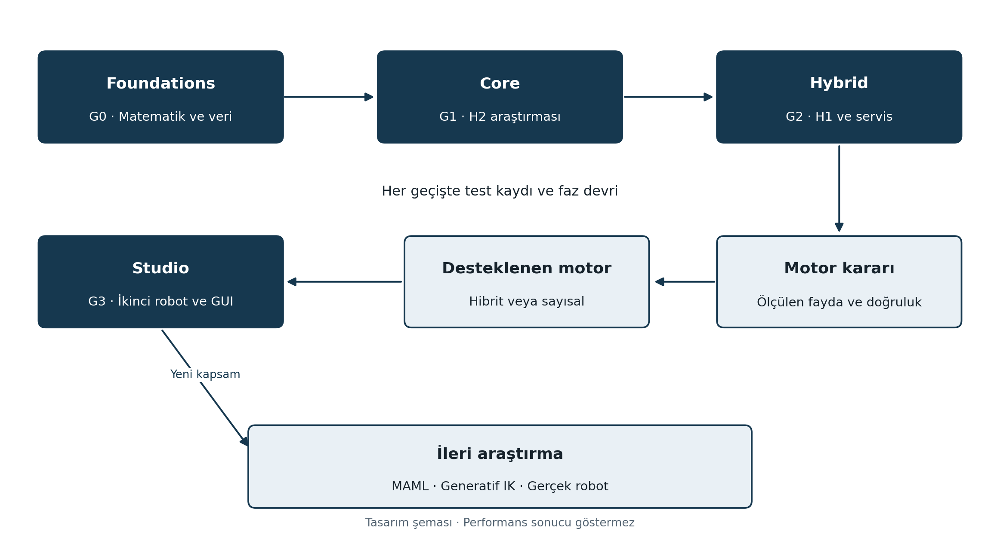

# Neuro şemsiyesi ve NeuroKinematics revize ana planı

Belge r1 · 17 Eylül 2026 · Proje sahibi Arda Tekgöz

## 1 Amaç ve ana karar

NeuroKinematics, URDF ile tanımlanan seri manipülatörler için robot başına öğrenilmiş ters kinematik başlangıçları üreten, çözümleri bağımsız kinematik hesaplarla denetleyen ve gerektiğinde sayısal iyileştirme kullanan bir araştırma ve mühendislik platformu olarak geliştirilecektir. İlk başarı ölçüsü, doğrulanabilir kod ve tekrarlanabilir deneydir. Nöral yöntemin her koşulda klasik çözücüleri geçmesi projenin varlık şartı değildir.

10 Ağustos 2026 tarihli ana rapor arşiv kaynağı olarak korunur. Yeni geliştirme kararları bu ana plan, dört ayrı faz raporu ve bunlarla eşleşen Markdown görev kayıtları üzerinden yönetilir. Revizyon; kapsamın sürümlere ayrılmasını, teknik ifadelerin düzeltilmesini, kaynakların güncellenmesini ve gereksinimlerin testlere bağlanmasını birlikte kapsar.

**Çalışma yöntemi:** Raporları ve teknik planı birlikte gözden geçirerek ilerleriz. Her faz başlamadan ilgili tasarımı dondurur, uygulama sırasında küçük görevler kapatır, faz sonunda kanıtları değerlendiririz. Sonraki fazın ayrıntıları elde edilen ölçümlere göre güncellenir. İlerideki raporlar bugün tasarımdır; tamamlanmış yazılım veya deney sonucu değildir.

| Hedef sürüm | Ayrı rapor | Faz sonunda elde edilecek ürün |
|---|---|---|
| v0.1 Foundations | 01 Foundations | Doğrulanmış kinematik, veri ve benchmark altyapısı |
| v1.0 Core | 02 Core | Nöral modeller, kontrollü ablasyon ve araştırma sonucu |
| v2.0 Hybrid | 03 Hybrid | Denetlenen hibrit IK, yörünge analizi ve ONNX hattı |
| v3.0 Studio | 04 Studio | İkinci robot, masaüstü mühendislik iş akışı ve paket |

Neuro şemsiye adıdır; ilk aktif ürün NeuroKinematics olur. NeuroKinSim adı, Studio içindeki kinematik görselleştirme bileşeninin geçmiş adı olarak korunabilir. NeuroLocalization, algılama ve tam robot kontrolü için bugün ayrı geliştirme hattı açılmaz. Bu alanlar somut ihtiyaç ve bağımsız proje tanımı oluştuğunda ele alınır.

### Durum ve varsayımlar

Bu paket tasarım ve planlama çıktısıdır. Yeni sürümlerin kodu, eğitimi, benchmarkı ve robot deneyleri henüz doğrulanmamıştır. İlk referans robot KUKA KR6 R900 sixx; haftalık çalışma kapasitesi 8–12 saat varsayılmıştır. Robot modelinin tam varyantı, URDF kaynağı, platform ve ölçüm donanımı F0-01 ile kayda bağlanacaktır. Önceki kod veya model ağırlıkları ancak aynı doğrulama kapılarından geçerse yeniden kullanılacaktır.

<!-- pagebreak -->

## 2 Sürümler ve bağımlılıklar

Foundations bütün sürümlerin matematik ve veri temelidir. Core, öğrenmenin katkısını sınar. Hybrid, Core modelinin üretim değerini ölçer; sonuç yetersizse sayısal çözücü destekli mühendislik platformu olarak devam etmek mümkündür. Studio, doğrulanmış servisleri kullanıcıya sunar.

| Kapı | Zorunlu kanıt | Kararın anlamı |
|---|---|---|
| G0 | Model kimliği, FK ve Jacobian testleri, veri denetimi | Hatalı matematik veya veri varken eğitim başlamaz |
| G1 | Baseline ve ablasyon kayıtları, bağımsız test sonuçları | Core araştırması kapanabilir; olumlu sonuç zorunlu değildir |
| G2 | Hibrit doğrulama, bütçe ve yörünge testleri, runtime eşliği | Hangi çözücünün destekleneceği kanıta göre seçilir |
| G3 | İkinci robot tekrar üretimi, uygulama ve kurulum testleri | Studio yalnızca test edilen platformlarda yayımlanır |

Bir kapıda **GEÇTİ**, **KALDI** veya **YÖN DEĞİŞTİR** kararı verilir. Araştırma hipotezinin reddi bir yazılım kusuru değildir. Buna karşılık yanlış FK, veri sızıntısı veya geçersiz bir sonucun başarılı işaretlenmesi kapatılmadan ilerlenemez.

Araştırma hattı ana sürüm takviminden ayrıdır. MAML, generatif çoklu çözüm, GNN, sim-to-real, ileri çarpışma kaybı, RL ve Edge optimizasyonu için ayrı giriş şartları vardır. İkinci robotu aynı kodla yeniden eğitmek, görülmemiş robota zero-shot aktarım kanıtı sayılmaz.

<!-- pagebreak -->

## 3 Ana rapora uygulanan revizyon mantığı

Revizyon yalnızca eski metnin bölünmesi değildir. Aynı kavramın farklı bölümlerde çelişen tanımları ortak sözleşmelere bağlanır. Tam izlenebilirlik tablosu `docs/REVISION_MAP.md` dosyasındadır; ana raporun 1–14 bölümleri ve eski A-0–A-12 görevleri yeni hedefleriyle eşleştirilmiştir.

| Eski içerik | Uygulanan karar | Yeni yer |
|---|---|---|
| Kinematik, URDF, sentetik veri | Korundu, destek sınırları ve sayısal testleri eklendi | Foundations |
| MLP, conditioning, FK ve limit kaybı | Deneysel varyantlara ayrıldı | Core |
| Jerk, trajectory, hibrit çözüm | Zaman ve bütçe sözleşmesiyle yeniden yazıldı | Hybrid |
| GUI, heatmap, paketleme | Doğrulanmış API üzerine taşındı | Studio |
| Multi-robot ve MAML | Yeniden eğitim ile transfer ayrıldı | Studio ve araştırma birikimi |
| Tek sürümlük takvim | İş yükü ve karar kapılarıyla değiştirildi | Dört roadmap |
| İddialı karşılaştırma tabloları | Ölçümsüz puan ve üstünlük ifadeleri çıkarıldı | CLAIMS ve deney planı |
| Kaynakça ve konuşma artıkları | Hatalı kayıtlar değiştirildi, konuşma metni çıkarıldı | Kaynak kaydı ve yeni raporlar |

### Başlıca teknik düzeltmeler

- Pieper koşulları genel bir gerekli ve yeterli koşul gibi kullanılmaz. Her 6 DoF robotun tam sekiz çözümü olduğu varsayılmaz.
- TRAC-IK, Newton temelli arama ile SQP yaklaşımını birleştirir; Newton–Euler ile DLS birleşimi olarak anlatılmaz. pick_ik ayrı bir güncel karşılaştırmadır [K04, K05].
- State conditioning çözüm dalı belirsizliğini azaltmayı hedefler; tekillikten, çarpışmadan veya bütün eklem sıçramalarından kaçınmayı garanti etmez.
- FK kaybı model tutarlılığı sağlar; fiziksel robot kalibrasyonunu, çarpışmasızlığı veya dinamik uygulanabilirliği kanıtlamaz.
- Sınır cezası, çıktı kontrolünün yerine geçmez. Clamping sonrasında FK ve gerekli diğer denetimler yeniden yapılır.
- Tekillik metriklerinde Jacobian görev boyutu ve uzunluk ölçeği açıklanır. Jerk zaman adımıyla hesaplanır. Rastgele örnekler yörünge gibi yorumlanmaz.
- Sinir ağı gecikmesi, toplam çözücü gecikmesinden ayrılır. Sayısal yakınsama garantisi ve hard real-time iddiası kullanılmaz.

Eski kaynakça [9] düzeltilmiştir. [10]–[13] için eşleşen güvenilir birincil yayın kaydı doğrulanamadığından bu kayıtlar yeni bilimsel dayanaklarda kullanılmaz. Bu karar kaynakların kesin olarak var olmadığını iddia etmez; doğrulama sağlanırsa ayrı inceleme yapılabilir.

<!-- pagebreak -->

## 4 Araştırma konumu ve kaynak omurgası

Katkı adayımız, robot başına veri üretimi ve öğrenilmiş başlangıç oluşturmayı ortak doğrulama ve benchmark düzeni içinde tekrarlanabilir hale getirmektir. Bunun akademik yeniliği henüz kanıtlanmış değildir. Aşağıdaki çalışmalar, tek tek mimari bileşenlerin yeni olduğu iddiasını daraltır.

| Çalışma | Doğrulanan yöntem veya kapsam | Projeye etkisi |
|---|---|---|
| Bensadoun ve diğerleri 2022 | ICML çalışması; koşullu dağılımlarla çoklu çözüm örnekleme | Eski tablodaki çoklu çözüm eksikliği kaldırıldı [K07] |
| CRiSP 2021 | FK modeli ile yapılandırılmış öğrenmeyi birleştirme | Model bilgili öğrenme tek başına yenilik sayılmaz [K08] |
| CycleIK 2024 | Farklı robot tasarımlarına uyarlanan neural IK ve hareket üretimi | Platform bağımsızlığı iddiası ölçülebilir sınırlara çekildi [K09] |
| IKDiffuser 2026 v4 | Kinematik ağaçlar için generatif çözüm ve optimizasyona başlangıç | Eski 2025 başlığı yerine güncel sürüm kaydı kullanıldı [K10] |
| MimicIK 2026 | Mevcut durum, delta eklem ve FK tutarlılığı | Conditioning ve delta çıktı deneysel tercihlerdir [K11] |
| AdaKineNet 2026 | FK/Jacobian bilgisi, ağırlıklı kayıp ve eklem kısıtları | Physics-aware mimari için özgünlük sınırı [K12] |

Bu karşılaştırma yöntem kapsamına dayanır. Farklı robot, veri, tolerans ve donanımdaki yayın sonuçları aynı başarı tablosunda sıralanmaz. MimicIK ve IKDiffuser kayıtları ön baskı statüsüyle; AdaKineNet kurumsal yayın kaydı ve özet düzeyinde kullanılmıştır. Birebir yeniden uygulama tamamlanmadan bu yöntemleri benchmarkta yenmiş olma iddiası kurulmaz.

### Üç sınanabilir araştırma sorusu

**H1 — Öğrenilmiş başlangıç:** Aynı sayısal algoritma, durdurma koşulu ve toplam süre bütçesinde neural seed, mevcut durum ve sabit başlangıca göre iterasyonu veya P95 toplam süreyi azaltıyor mu? Hybrid fazında sınanır.

**H2 — Model bilgili kayıp:** Aynı veri ve karşılaştırılabilir model kapasitesinde FK ve limit bileşenleri, supervised modele göre zor alt kümelerde geçerli çözüm oranını artırıyor mu? Core fazında sınanır. Olumsuz sonuç raporlanır.

**H3 — Tekrarlanabilir kurulum:** Aynı kod sürümü, yalnızca robot tanımı ve konfigürasyon değiştirilerek ikinci robotun veri, eğitim, değerlendirme ve paketleme hattını üretebiliyor mu? Studio fazında sınanır. Her robot ayrı ağırlık kullanabilir.

### Sınırlılıklar

Bir simülasyon modelinden üretip aynı modele göre değerlendirmek, fiziksel doğruluğu değil model içi tutarlılığı ölçer. Tek robot ve sınırlı test dağılımı genelleme iddiasını sınırlar. Test verisine göre hiperparametre değiştirmek sonucu geçersiz kılar. Yayın kabulü, ticari talep ve gerçek robot performansı yazılım sürümünün otomatik sonucu değildir.

<!-- pagebreak -->

## 5 Ortak geliştirme ve kanıt sistemi

Her iş, gereksinim kimliği → görev kimliği → test kimliği → kanıt yolu → karar → sonraki bağımlılık zinciriyle izlenir. Bir görevin kodunun yazılmış olması kapanış için yeterli değildir. Çalıştırılan komut, ortam, ham çıktı ve sonuç değerlendirmesi aynı görev kaydında bulunmalıdır.

| Belge veya klasör | İşlev | Güncelleme zamanı |
|---|---|---|
| `docs/raporlar/` | Sürümün kapsamı ve teknik gerekçesi | Faz başlangıcı ve kapanışı |
| `docs/roadmaps/` | Bağımlılıklar, sıra, kabul şartları | Her kapatılan görevden sonra |
| `docs/tasks/` | Yapılacak iş ve uygulama kaydı | Her çalışma oturumu |
| `docs/adr/` | Mimari karar ve alternatifler | Karar değiştiğinde |
| `docs/records/` | Sonuç, faz devri ve mevcut durum | Deney ve faz kapanışı |
| `experiments/` | Gelecekteki konfigürasyon ve ham ölçümler | Her deneyde |

**Durum sözlüğü:** PLANLANDI, DEVAM EDİYOR, ENGELLİ, TEST EDİLDİ, KAPANDI, ERTELENDİ. Bu pakette yazılım görevleri PLANLANDI durumundadır. Kabul ölçütleri tasarım hedefleridir; sonuç hücreleri ÖLÇÜLMEDİ olarak başlar.

**Kapanış tanımı:** Kod farkı açıklanmış, ilgili gereksinim sınanmış, kritik test geçmiş, kanıt kimliği ve commit yazılmış, başarısız örnekler saklanmış, sonraki görevin girdileri listelenmiş olmalıdır. Başarısız deney de yöntemi ve sonucu kaydedilerek kapanabilir; geçersiz matematik üzerine bağımlı iş açılamaz.

**Sürüm politikası:** Yazılım hedefleri v0.1.0, v1.0.0, v2.0.0 ve v3.0.0 olarak izlenir. Bu dosyaların r1 etiketi belge revizyonudur. Yazılım etiketi yalnızca ilgili kapı kapandıktan sonra verilir. Gereksinim değişikliği ayrı ADR, yeni konfigürasyon sürümü ve gerekirse yeni test kümesi üretir; eski deneyler yeniden adlandırılıp başarılı gösterilmez.

**Tekrar üretim:** Commit, bağımlılık kilidi, robot ve veri SHA256 değerleri, rastgele seed, eğitim ayarları, normalizasyon, donanım, işletim sistemi, yürütücü ve thread sayısı kaydedilir. Ağır veri ve modellerin kendisiyle metadata ayrılır. Temiz kurulumda küçük doğrulama deneyi çalıştırılır; büyük deneyin yeniden çalıştırma tarifi de saklanır.

**Profesyonel çalışma önerisi:** Aynı anda tek ana teknik görev yürütmek ve haftalık kısa değerlendirme yapmak kapsamın büyümesini kontrol eder. İki haftalık bir iş penceresinde hedef, saat bütçesi, gözlenen sorun ve bir sonraki deney açıkça yazılır. Danışman görüşü bir karar kaydıyla projeye girer; raporun tamamı her görüşmede baştan yazılmaz.

<!-- pagebreak -->

## 6 İş yükü ve sürdürülebilir takvim

Aşağıdaki saatler tek öğrenci için geliştirme, öğrenme, hata ayıklama, deney analizi ve dokümantasyon tahminidir. Eğitim makinelerinin gözetimsiz çalışma süresi ayrıca kaydedilir. Kesin bitiş tarihi değildir. İlk iki teknik görevin gerçekleşen süresiyle tahminler yeniden kalibre edilir.

| Faz | Etkin emek tahmini | 10 saat haftalık kapasitede |
|---|---|---|
| Foundations | 60–90 saat | 6–9 hafta |
| Core | 100–160 saat | 10–16 hafta |
| Hybrid | 90–140 saat | 9–14 hafta |
| Studio | 80–130 saat | 8–13 hafta |
| Toplam | 330–520 saat | 33–52 hafta |

Takvime ayrıca yüzde 25 belirsizlik payı ayrılır: toplam 413–650 saat. Haftada 8 saatte yaklaşık 52–82, 12 saatte 35–55, 20 saatte 21–33 hafta karşılığıdır. Sınav haftaları ve robot erişimi beklemeleri buna ek olabilir. “İlk 90 günde bütün sistemi bitirme” taahhüdü verilmez.

İlk 90 günün ana hedefi Foundations kapısını kapatmak ve kapasite elverirse Core baseline deneylerini başlatmaktır. F0-00 kapsamı, F0-01 robot tanımını, F0-02 FK doğrulamasını, F0-03 Jacobian denetimini, F0-04 veriyi, F0-05 benchmarkı ve F0-06 faz devrini kapsar. Hafta yerine kapı sonucu ilerlemeyi belirler.

### Kaynaklar ve maliyet sınırı

İlk iki faz mevcut bilgisayarda CPU doğrulaması ve küçük veri üzerinde başlar. GPU eğitim için yararlıdır; yeni donanım alımı başlangıç şartı değildir. 10 bin örnekle davranış doğrulandıktan sonra 100 bin ve gerekirse 1 milyon örneğe geçilir. Bulut bütçesi veya Jetson alımı planlanmış harcama değildir; ölçülen darboğaz ortaya çıkarsa ayrıca karar verilir.

Referans geliştirme ortamı Linux olarak önerilir; Windows üzerinde çalışma gerekiyorsa uyumluluk katmanı veya ayrı ortamın maliyeti F0-00 içinde kaydedilir. GUI dağıtımında tek işletim sistemi önce doğrulanır. Donanım bağımlı gecikme sonuçları ölçüm yapılan platformla birlikte adlandırılır.

### Ticari yön

İlk kullanıcı profili robotik öğrencisi veya araştırmacıdır. Studio aşamasında robot tanıtma, deney tekrar üretme, hata açıklama ve rapor dışa aktarma işleri değerlendirilir. Entegratörlere zaman kazandırma hipotezi, görev tamamlama süresi ve kullanıcı görüşmesiyle ölçülür. Bugün gelir, pazar payı, patentlenebilirlik veya ticari dağıtım uygunluğu sonucu verilmez.

Bağımlılık ve robot varlıkları için kaynak, sürüm, lisans, dağıtılan dosya ve gerekli bildirim alanlarını içeren envanter tutulur. Pinocchio ve pytorch_kinematics kayıtları başlangıç kaynağıdır; kullanılan kesin sürümün lisansı paketleme sırasında yeniden kaydedilir. Qt bileşenlerinin koşulları ayrıca incelenir [K01, K02, K14].

<!-- pagebreak -->

## 7 Riskler ve kapsam değişikliği

| Risk | Tetikleyici | Karar |
|---|---|---|
| Kinematik tutarsızlık | FK veya Jacobian toleransı aşılır | Eğitimi durdur, model sözleşmesini düzelt |
| Veri sızıntısı | Test grubunun eğitimde bulunması | Deneyi geçersiz say, bölümü yenile |
| Nöral katkı zayıf | Önceden belirlenen etki eşiği sağlanmaz | Core sonucunu raporla, sınırlı hybrid deneyi yap |
| Hybrid katkı zayıf | Süre kazancı yok veya başarı düşer | Sayısal motoru desteklenen varsayılan yap |
| Kapsam büyümesi | Yeni iş faz saat bütçesini yüzde 20 aşırır | Özelliği araştırma birikimine taşı veya planı revize et |
| Paketleme sorunu | Temiz sistemde çalışma başarısız | Desteklenen platformu sınırla, kapıyı açık tut |

Her faz devrinde şu sorular yanıtlanır: Ne uygulandı? Hangi test çalıştı? Hangi iddia desteklendi veya reddedildi? Ne henüz ölçülmedi? Sonraki faz hangi dosya, model ve kararları devralıyor? Bu yanıtlar `docs/templates/PHASE_HANDOFF.md` biçiminde kalıcı kayda girer.

İlk geliştirme adımı F0-00 kapsam ve ortam sözleşmesidir. Ardından robot dosyası doğrulanır. İlk kod hedefi eğitilmiş bir ağ değil, bilinen eklem değerlerinden güvenilir TCP dönüşümü ve bunu kontrol eden testlerdir.

## 8 Kaynaklar

K01 [Pinocchio resmi depo ve belgeleri](https://github.com/stack-of-tasks/pinocchio) · K02 [PyTorch Kinematics resmi depo](https://github.com/UM-ARM-Lab/pytorch_kinematics).

K04 [MoveIt TRAC-IK açıklaması](https://moveit.picknik.ai/main/doc/how_to_guides/trac_ik/trac_ik_tutorial.html) · K05 [MoveIt pick_ik açıklaması](https://moveit.picknik.ai/main/doc/how_to_guides/pick_ik/pick_ik_tutorial.html).

K07 [Bensadoun ve diğerleri Neural Inverse Kinematic](https://proceedings.mlr.press/v162/bensadoun22a.html), ICML 2022, PMLR 162, 1787–1797.

K08 [Marconi ve diğerleri CRiSP](https://arxiv.org/abs/2102.12942v3), 2021. K09 [Habekost ve diğerleri CycleIK](https://arxiv.org/abs/2404.08825v2), IROS 2024.

K10 [Zhang ve Jiao IKDiffuser](https://arxiv.org/abs/2506.13087v4), 2026 revizyonu, ön baskı. K11 [Yang ve diğerleri MimicIK](https://arxiv.org/abs/2606.15148v2), 2026, ön baskı.

K12 [Fang ve diğerleri AdaKineNet](https://scholar.xjtlu.edu.cn/en/publications/adakinenet-adaptive-kinematic-neural-network-for-inverse-kinemati/), Robotics and Autonomous Systems 202, 105494, 2026; DOI 10.1016/j.robot.2026.105494.

K14 [Qt for Python lisans bilgileri](https://doc.qt.io/qtforpython-6/licenses.html). Tam kaynak kaydı, erişim düzeyi ve kullanım notları `docs/references/SOURCES.md` dosyasındadır. Web kaynakları 17 Eylül 2026 tarihinde kontrol edilmiştir.
