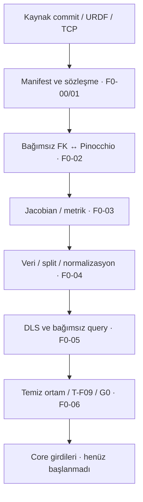
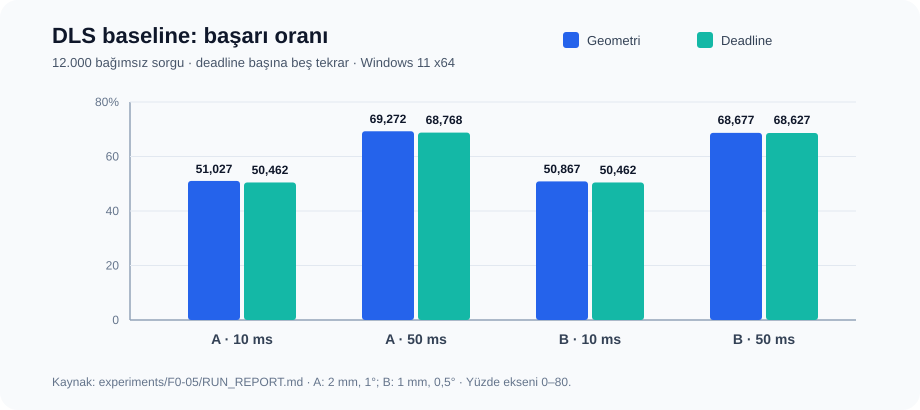

# NeuroKinematics Foundations: doğrulanabilir robot kinematiği, veri üretimi ve sayısal IK baseline

**Uygulama ve sonuç raporu · belge revizyonu r2 · 24 Eylül 2026**  
**Proje sahibi:** Arda Tekgöz · **Raporlayan:** Codex · **Hedef yazılım:** v0.1.0 · **Karar:** G0 PASS / ACCEPTED  
**İncelenen kapanış commit'i:** `93e9111e1e43e37223142c0fab84642a42201a7d`  
**Kapsam:** F0-00–F0-06; native Windows 11 x64. Bu metin [uygulama öncesi r1 tasarım raporunun](01_Foundations_v0_1_r1.md) yerine geçmiş sonuç belgesidir; tarihsel r1 dosyası korunur.

## Öz

Neural ters kinematik deneyleri, model/koordinat hatası ile öğrenme hatasının birbirine karışmaması için doğrulanmış bir hesap ve değerlendirme altyapısı gerektirir. Foundations fazında KUKA KR 6 R900 sixx modelinin kimliği ve sabit TCP sözleşmesi hashlerle sabitlendi; Pinocchio referansından algoritmik olarak ayrı bir seri-zincir ileri kinematik (FK), üç yoldan Jacobian kontrolü, deterministik veri fabrikası ve sabit sönümlemeli DLS sayısal IK baseline'ı geliştirildi. 10.000 konfigürasyon için maksimum FK konum farkı `4.75098925995612e-16 m`, dönme matrisi Frobenius farkı `9.159602786276758e-16` oldu. 12.000 bağımsız IK sorgusunda beşer tekrar ve iki deadline ile 120.000 sonuç kaydı alındı; sıkı Profil B'de 50 ms deadline başarı oranı %68,627 olarak ölçüldü. Temiz kilitli Windows ortamında 497 regresyon ve 26 F0-06 kapanış testi geçti; iki küçük üretim aynı veri ve sorgu içeriği hashlerini verdi. G0 kabul edildi ve Core için girdiler devredildi. Sonuçlar yalnız **model-içi sayısal doğruluk ve bu hosttaki ölçümleri** destekler; fiziksel kalibrasyon, çarpışmasızlık, gerçek-zaman garantisi veya öğrenilmiş model başarısı kanıtlanmadı.

**Anahtar sözcükler:** ileri/ters kinematik, robot model doğrulama, Jacobian, DLS, deterministik veri, benchmark, yeniden üretilebilirlik.

## 1. Araştırma sorusu, kapsam ve katkı

Ana soru şudur: *Aynı ve değişmez robot modeli için bağımsız kinematik hesap, referans hesap, veri etiketleri ve sayısal IK sonuçları birbirleriyle izlenebilir biçimde tutarlı ve temiz ortamda yeniden üretilebilir mi?* Bu faz neural yöntemin mevcut çözücüleri geçip geçmediğini sınamaz. [SPEC](../SPEC.md), [Foundations roadmap](../roadmaps/F0_Foundations.md) ve [izlenebilirlik](../TRACEABILITY.md) önce tanımlanan gereksinimleri ve kabul sınırlarını verir. G0, bir araştırma üstünlüğü kararı değil, Core deneylerinin güvenilir giriş kapısıdır.

Katkılar: (i) exact kaynak ve robot varlığı manifesti, (ii) referansla algoritmik olarak ayrı FK/Jacobian yolları, (iii) deterministik ve sızıntı denetimli sentetik veri, (iv) query-bağımsız DLS benchmark ve ayrık geometri/deadline statüleri, (v) önceki kanıtların tarihsel commitlerle bağlandığı temiz-ortam kapanışı. Kaynak kodu ve makine-okunur kanıtlar bu depodadır; Git dışında tutulan büyük üretim dosyalarının başka makinede bulunduğu varsayılmaz.

### İlgili yöntemler ve konumlandırma

Pinocchio'nun resmî yazılım kaydı, ileri kinematik ve analitik türevleri destekleyen bir robotik kütüphane olduğunu ve akademik kullanım için yazılım makalesini işaret eder [6]. Bu çalışmada Pinocchio, fiziksel ölçüm cihazı değil, **aynı URDF'nin referans sayısal uygulaması** olarak kullanılmıştır. Wampler'ın klasik damped least-squares ters kinematik çalışması [7] yöntemin kuramsal bağlamını verir; burada kullanılan sabit sönümlemeli DLS, o literatürdeki tüm yöntemlerin veya uyarlamalı varyantların performans temsili değildir. Foundations'ın özgün katkısı yeni bir IK teoremi değil, bu iki yöntemi açık kimlik, veri ve ölçüm sözleşmesiyle denetlenebilir hale getirmektir.

| Aşama | Neden gerekli? | Üretilen başlıca çıktı | Kapı |
|---|---|---|---|
| [F0-00](../../experiments/F0-00/RUN_REPORT.md) | Birim, platform, model ve kabul belirsizliğini kapatmak | SPEC, ADR, locked ortam | T-F00 |
| [F0-01](../../experiments/F0-01/RUN_REPORT.md) | Hangi robot ve TCP'nin hesaplandığını sabitlemek | URDF, robot-spec, kaynak/mesh manifesti | T-F01 |
| [F0-02](../../experiments/F0-02/RUN_REPORT.md) | FK etiketinin adaptör hatasından etkilenmediğini sınamak | Bağımsız NumPy FK ve Pinocchio karşılaştırması | T-F02 |
| [F0-03](../../experiments/F0-03/RUN_REPORT.md) | Türev/tekillik ve yönelim metriklerini kontrol etmek | Geometrik/Pinocchio/merkezi fark Jacobian | T-F03–04 |
| [F0-04](../../experiments/F0-04/RUN_REPORT.md) | Öğrenme öncesi örnek kimliği ve split güvenliği | Shardlı dataset, split, normalizasyon, coverage | T-F05–07 |
| [F0-05](../../experiments/F0-05/RUN_REPORT.md) | Gelecek yöntemler için açık sayısal referans kurmak | DLS, bağımsız query listesi, benchmark JSONL | T-F08 |
| [F0-06](../../experiments/F0-06/RUN_REPORT.md) | Önceki kabulün temiz kurulumda bütün olduğunu sınamak | Kanıt indeksi, iki smoke üretimi, G0 ve Core devri | T-F09 |

**Şekil 1 —** Girdiden faz kapısına kanıt akışı; her ok önceki çıktının sonraki aşamada doğrulandığı bağı gösterir.

## 2. Materyal ve yöntem

### 2.1 Robot, kimlik ve koordinat sözleşmesi

İncelenen robot, fixed-base, altı döner eklemli **standart KUKA KR 6 R900 sixx** varyantıdır. Model `kroshu/kuka_robot_descriptions` 2.0.2 release, commit `fbda927964caa1eb4e408fb0c25fe46b5a0bde3c` snapshot'ından çözülmüştür. Eklem sırası `joint_1`–`joint_6`, görev pozu `base_link` çerçevesinden `tool0` TCP'ye göredir. Metre/radyan, sağ elli koordinatlar, sütun vektörü ve API sınırında `w,x,y,z` quaternion sırası uygulanır. F0-01'de 29 dağıtılan dosya ve 14 mesh URI doğrulandı; Pinocchio modeli `nq=nv=6` olarak parse etti. [F0-01 manifest kanıtı](../../experiments/F0-01/manifest-verification.json).

Değişmez örnek kimlikleri: URDF SHA-256 `83d140b03558e4b8ad428d0e07d16a31bc38c0fee643af049e4b75868a4d0a96`; canonical robot-spec `4f97a2059d68a9b14fce50aed63628f3e664950033276b75c6a2cebd979ed95d`; TCP `52e96ebfadedbc2191d1d0b2dac646c81119973c8151b3d91e800ae0bea13e18`. Tam devir listesi [handoff-inputs](../../experiments/F0-06/handoff-inputs.json) içindedir. Üretici PDF'sinin raw bayt/hash kaydı bulunmaz; upstream kaynak/varlık doğrulamasıyla fiziksel geometri doğrulaması aynı iddia değildir.

### 2.2 Bağımsız FK ve hata ölçümü

NumPy uygulaması URDF seri yolunu ve sabit eklemleri kendi XML çözümlemesinden kurar, her eklemde `T_origin @ T_motion(q)` çarpar, flange–tool0 sabit dönüşümünü korur. Pinocchio referansı aynı immutable URDF baytlarından ama ayrı algoritma/adaptör üzerinden `T_base_tool0` üretir. Bağımsız yolun Pinocchio import edemeyen ayrı süreçte çalışması da sınanmıştır. Böylece yalnız bir kütüphanenin sonucunu tekrar paketlemekle yetinilmez; **ortak yanlış URDF riski** yine kalır.

\[
T_{base,TCP}(q)=T_{base,0}\prod_{i=1}^{6}\left(T_{origin,i}T_{motion,i}(q_i)\right)T_{flange,TCP}.
\]

Konum farkı iki çıktının öteleme vektörleri arasındaki L2 norm, yönelim farkı ise dönme matrislerinin Frobenius normudur. F0-02 kabulü, seed `20260918` ve PCG64 ile limit içinden üretilmiş **10.000 float64** konfigürasyonda iki maksimumun da `≤1e-9` olmasını gerektirir. Eşitlik eşiği gerçek robot hassasiyeti değildir. Ayrıca 21 elle seçilmiş q ve olumsuz girdi/hatalı frame testleri uygulanmıştır. [Config](../../experiments/F0-02/config.json), [ham özet](../../experiments/F0-02/fk-validation-summary.json).

### 2.3 Jacobian, yönelim ve tekillik

Geometrik Jacobian ile Pinocchio'nun uygun referans-frame çıktısı, aynı TCP noktasında ve base eksenlerinde çizgisel ardından açısal satır düzenindedir. Merkezi farktaki yönelim türevi SO(3) loguyla hesaplanır; Euler açı farkı kullanılmaz. Farklı birimli satırlar, manifestten gelen `ℓ=0.9015 m` ile ölçeklenir. Normalize fark, iki ölçekli Jacobian farkının Frobenius normunun `max(1, ||J_ref||_F)` ile bölümüdür. Kabul sınırı `1e-5`; ana adım `h=1e-6 rad`, duyarlılık adımları `1e-5` ve `1e-7 rad`. 256 deterministik q (seed `20260919`) ile 21 seçilmiş q birlikte denetlenmiştir. [F0-03 özet ve duyarlılık](../../experiments/F0-03/jacobian-validation-summary.json).

SVD'den `σ_min`, koşul sayısı ve manipulability hesaplanır; tam tekillikte `σ_min=0`, koşul sayısı `Inf` ve manipulability `0` açıkça tutulur. Poz, 0°/90°/180°, `q/-q` quaternion eşdeğerliği ve sayısal sınırlar T-F04'e dahildir. Near-singular sonlu farkın hassasiyeti gizlenmez.

### 2.4 Deterministik veri ve leakage denetimi

F0-04 ana havuzu LHS, karşılaştırma havuzu uniform; ana kayıtta **10.000**, iki zor alt kümede **1.000'er** örnek vardır. Ana split **7.000/1.500/1.500** train/validation/test'tir; sınır/tekillik alt kümeleri ayrı ayrı **700/150/150**. Grup kökenleri split öncesi atanır; normalizasyon yalnız 7.000 ana train kaydından öğrenilir. Aynı `q`'nun çapraz-split tekrarları ve grup kesişimleri denetlenir. İki bağımsız üretimde 12 shardın hem dosya hem canonical içerik hashleri eşleşmiştir; ana dataset content SHA-256 `5cb4e64580ecaf99afd11b3c8b98e06ed00c712e83bf2d9ee4d8c3acd58173fe`. [F0-04 manifest](../../experiments/F0-04/dataset-manifest.json), [split](../../experiments/F0-04/split-audit.json), [normalizasyon](../../experiments/F0-04/normalization.json).

Boundary etiketi en az bir eklemin normalize limite uzaklığının **strict <0,02** olmasıdır; gözlenen maksimum `0.0199999437235451`. Bu, Kartezyen çalışma alanı sınırı değildir. Singularity eşiği **0,00727741160967353**, yalnız ana train `σ_min` dağılımının yüzde 5 quantile'ından sabitlenmiştir; 20.373 adaydan 1.000 kabul edildi. Coverage önceden tanımlanmış voxel/profil ölçümüdür, robotun gerçek erişilebilir uzay yüzdesi değildir.

### 2.5 Sayısal çözücü ve benchmark

F0-05, sabit damping'li DLS düzeltmesini açık matris tersi yerine lineer sistem çözümüyle uygular. Ölçekli Jacobian ve hata aynı frame/TCP sözleşmesini izler:

\[
\Delta q=\widetilde J^{\mathsf T}\bigl(\widetilde J\widetilde J^{\mathsf T}+\lambda^2 I\bigr)^{-1}\widetilde e.
\]

Bu formül yerel bir iterasyon adımıdır, küresel yakınsama garantisi değildir. A profili **2 mm ve 1°**, daha sıkı B profili **1 mm ve 0,5°** birlikte karşılanır. Geometri başarısı, sonuç zaman bütçesinden geç dönse bile deadline başarısından ayrı tutulur. Son adayın FK'sı bağımsız Pinocchio yoluyla tekrar hesaplanır. Solver'a `q_target` verilmez; yalnız `q_current`, hedef poz ve deadline verilir. Analitik kanıt yoksa çözücü başarısızlığı `PROVEN_UNREACHABLE` değil `UNRESOLVED` olarak ele alınır. Collision durumu `NOT_CHECKED`. [Matematik ve ölçüm sözleşmesi](../../experiments/F0-05/benchmark-contract.json).

Sorgular F0-04 örneklerinden bağımsızdır: **10.000 main, 1.000 boundary, 1.000 singularity**; her alt kümenin yarısı local, yarısı wide başlangıçlıdır. Aynı 12.000 sorgu iki deadline (10/50 ms) ve beş ölçüm geçişinde kullanıldı: `12.000 × 2 × 5 = 120.000` sonuç; **120.000 bağımsız hedef değil**. Warm-up, veri yükleme ve serileştirme süreleri çözüm zamanından ayrı kaydedildi. Ölçüm `perf_counter_ns` ile tek hostta seri CPU koşusudur. Query hash'i `120b41f07109aeaca10e10fbb04783167cdc4ba282e7976941468c7dccfa4976`; sonuç JSONL hash'i `b18161e53ca3ced0266d825afef7d9535036b9ed3d5617606ea6290f1926a724`. Büyük ham JSONL Git dışında; [manifestler](../../experiments/F0-05/result-manifest.json) ve yeniden üretim tarifleri sürümlüdür.

### 2.6 Yeniden üretim ve kabul kapısı

F0-06, F0-05 kapanış commit'i `e7d211f42496f803688e2a510daca97e102092dc` tabanından yeni detached worktree açıp hashli F0-06 overlay'ini uyguladı; yeni proje `.pixi`, pytest cache ve üretilmiş veri yoktu. `pixi install --locked` ve `pixi lock --check` geçti. Global paket indirme cache kullanıldığı için deney **tamamen önbelleksiz** olarak tarif edilmez. Windows 11 x64, Pixi 0.81.0, Python 3.12.14, NumPy 2.5.3 ve Pinocchio 4.1.0 kaydedildi. [Temiz ortam komutları](../../experiments/F0-06/COMMANDS.md), [koşu kaydı](../../experiments/F0-06/RUN_REPORT.md).

Önceki görevlerin **212 checksum**, Stage-1'in **18** kaydı ve yerel Git-dışı **14** büyük dosya kendi tarihsel commit/bayt bağlamında denetlendi. F0-06'nın güncel [SHA256SUMS](../../experiments/F0-06/SHA256SUMS) listesinde **254** kayıt doğrulandı. Eski ortak dosyaların bugünkü baytlarıyla tarihsel hashlerin eşit olması beklenmez; ilgili commit blobu denetlendi. Temiz testte F0-00/01/02/03/04, F0-05 unit, T-F08 ve F0-05 mutasyon grupları **497/497** geçti; ayrı F0-06 testi **26/26** geçti (bir pozitif, 25 negatif). İki küçük gerçek uçtan uca koşunun her birinde **384 veri, 384 query, 768 DLS sonuç satırı** üretildi. Veri ve query hashleri aynı; zaman ve timeout'a bağlı ham sonuçların hash eşitliği gerekli değildir. [Tekrar üretim özeti](../../experiments/F0-06/reproduction-summary.json), [kanıt indeksi](../../experiments/F0-06/FOUNDATIONS_EVIDENCE_INDEX.json).

## 3. Bulgular

### 3.1 FK ve Jacobian

| Ölçüm | Örneklem | Kabul | Ölçülen maksimum | Değerlendirme |
|---|---:|---:|---:|---|
| FK konum L2 | 10.000 q | ≤1e-9 m | 4.75098925995612e-16 m | PASS |
| FK dönme Frobenius | 10.000 q | ≤1e-9 | 9.159602786276758e-16 | PASS |
| Geometrik–Pinocchio normalize Jacobian | 256 q, üç h | ≤1e-5 | 2.9189048438105259e-16 | PASS |
| Geometrik–merkezi, h=1e-6 | 256 q | ≤1e-5 | 1.7676058530094515e-10 | PASS |
| Geometrik–merkezi, h=1e-7 | 256 q | ≤1e-5 | 2.138908943620868e-9 | PASS |

FK farkları float64 yuvarlama düzeyindedir; verilen kabul eşiklerinin çok altındadır. Bu, iki hesap yolunun **aynı sayısal modeli** hesapladığına güçlü kanıttır, fiziksel TCP konum hatasının femtometre düzeyinde olduğuna kanıt değildir. F0-03'te `h` küçüldüğünde sonlu fark hatasının tekrar büyümesi yuvarlama hassasiyetiyle uyumludur; 21 seçilmiş örneğin `h=1e-7` en büyüğü `2.327181019633208e-9` olup yine kabul altındadır. [F0-02 dağılımı](../../experiments/F0-02/fk-validation-summary.json), [F0-03 duyarlılık](../../experiments/F0-03/jacobian-sensitivity.json).

### 3.2 Veri bütünlüğü ve ampirik kapsam

| Denetim | Ölçüm | Yorum |
|---|---:|---|
| İki üretimde shard dosya/içerik eşliği | 12/12 + 12/12 | Sabit seed/config altında deterministik |
| Main split | 7.000 / 1.500 / 1.500 | Train/validation/test |
| Hard split (her biri) | 700 / 150 / 150 | Ayrı alt kümeler |
| Çapraz split grup ve exact-q kesişimi | 0 | Bu ölçülen tanıma göre leakage gözlenmedi |
| Bağımsız FK'ye göre maksimum etiket FK farkı | 6.69794233840692e-16 m; 9.46264227718545e-16 Frobenius | Aynı model üzerinde tutarlı |
| Birincil grid combined-pose doluluğu | LHS 9.998; uniform 10.000 | Örnek havuzu occupancy'si; yüzde erişim değil |

Pozisyon birincil grid doluluğu LHS 7.626, uniform 7.630; orientation 7.844 ve 7.815'tir. Grid incelik/kabalık değişince doluluk değişir: combined-pose LHS 10.000/9.998/9.987, uniform 10.000/10.000/9.990 (ince/birincil/kaba). Bu nedenle tek bir doluluk sayısı evrensel coverage diye sunulmaz. [Coverage/sensitivity](../../experiments/F0-04/coverage-sensitivity.json).

### 3.3 DLS ölçümleri

**Şekil 2 —** F0-05 geometri ve zamanında başarı oranları; her bar tüm ilgili `12.000 × 5 = 60.000` denemeden türemiştir. Sorgular her deadline'da aynı olduğundan barlar bağımsız örneklem değildir.

| Profil | 10 ms geometri | 10 ms deadline | 50 ms geometri | 50 ms deadline |
|---|---:|---:|---:|---:|
| A (2 mm, 1°) | %51,027 | %50,462 | %69,272 | %68,768 |
| B (1 mm, 0,5°) | %50,867 | %50,462 | %68,677 | %68,627 |

Profil B / 50 ms alt gruplarında main/local %100, main/wide %38,088; boundary/local %100, boundary/wide %33,560; singularity/local %100, singularity/wide %32,600 deadline başarısı ölçülmüştür. Bunlar sorgu sınıfları arasında sayısal baseline davranışını açıklar; diğer yöntemlere üstünlük kıyası yapılmamıştır. 120.000 satırın terminal durumları: `SUCCESS=71.521`, `TIMEOUT=40.486`, `STALLED=7.993` (toplam 120.000). Ortak limit ihlali sıfır. B/50 ms başarıyla biten ölçümlerin latency P50/P95/P99 değerleri **2,014 / 21,427 / 34,087 ms**; tüm denemelerinki **5,857 / 50,656 / 51,044 ms**. Yalnız başarıları raporlamak süre dağılımını iyimser gösterirdi. [Solver](../../experiments/F0-05/solver-summary.json), [alt grup](../../experiments/F0-05/subgroup-summary.json), [deadline](../../experiments/F0-05/deadline-summary.json).

### 3.4 T-F09 ve G0 özeti

| Kapı bileşeni | Gözlem | Karar |
|---|---|---|
| T-F00–T-F08 temiz regresyon | 497 PASS, 0 fail/skip | PASS |
| F0-06 kapı testleri | 26 PASS; 25 negatif kontrol | PASS |
| İki smoke dataset hash'i | Her ikisi `0f5e08c735ca1e4432700d93f6d649a5718e612d548ca387893953ee9b66da69` | Eş |
| İki smoke query hash'i | Her ikisi `047938c1e16f156a32cf8ff25a88e7bf3105e1504fa61669892080f1922a8afa` | Eş |
| Ham sonuç hashleri | A `faf12e76…10cff`; B `8a52b578…4836f0d` | Zaman bağımlı, eş olması beklenmez |
| Tarihsel ve yeni bütünlük | 212 tarihsel, 254 F0-06 checksum kaydı | PASS |
| G0 | [Karar anlatısı ve kanıt yolu](../../experiments/F0-06/G0_DECISION.md) | PASS / ACCEPTED |

Karar dosyası ve Git commit izi kanıttır; kriptografik dijital imza iddiası yoktur. F0-06 denetimi, farklı sonuç JSONL hashlerini başarıya çevirmek için kabul eşiği değiştirmemiş; yalnız deterministik alan projeksiyonunu karşılaştırmıştır.

## 4. Tartışma ve geçerlik sınırları

**İç geçerlik.** İki FK/Jacobian yolunun algoritmik ayrılığı, mutasyon ve hata-enjeksiyon testleri çerçeve/sıra/TCP hatalarının yakalanabilirliğini artırır. Ancak aynı URDF yanlışsa iki yol da ortak yanlılığı taşıyabilir. F0-04 split grubu ve exact-q testleri ölçülen sızıntı sınıflarını kapatır; bütün olası semantik benzerlikleri ortadan kaldırdığını kanıtlamaz. Singularity threshold train-only dondurulmuş, validation/test'e uydurulmamıştır.

**İstatistiksel yorum.** F0-05 oranlarının paydası her deadline için 60.000 ölçümdür; bağımsız sorgu sayısı 12.000'dir. Beş tekrar korelasyonlu olduğundan bunları bağımsız 60.000 hedef gibi kullanarak güven aralığı/hipotez testi çıkarılmadı. Çıktılar bu sorgu tasarımı ve başlangıç dağılımı için betimleyicidir; genel robot görev dağılımının tahmini değildir. 10/50 ms sert bütçeler host, scheduler ve bağımsız validasyon süresine duyarlıdır.

**Dış geçerlik ve güvenlik.** Linux `NOT_RUN`; lock çözülmesi Linux'ta çalışma kanıtı değildir. Fiziksel robot konum ölçümü, kalibrasyon, yük/dinamik, çarpışma, iş hücresi güvenliği ve sert gerçek-zaman davranışı incelenmedi. Meshlerin depoda var olması collision checking yapıldığı anlamına gelmez. Üretici PDF ham hash eksikliği kayıtlıdır. Coverage ampirik örnek/grid doluluğudur. DLS wide-start başarısındaki sınırlılık saklanır; bir çözücü durumu hedefin fiziksel veya kinematik olarak erişilemez olduğunu kanıtlamaz.

**Bilimsel sonuç.** Robot/koordinat sözleşmesi ve yazılım-içi kinematik/yeniden üretim hipotezleri bu protokol altında desteklenmiştir. DLS'nin geniş başlangıç zayıflığı gözlemdir; önceden başarı-oranı kapısı olmadığı için G0'ı geçersiz kılmaz. Neural IK üstünlüğü, ablation, harici solver karşılaştırması ve gerçek zamanlı sistem hipotezleri **test edilmedi**. Bu ayrım [Core devir kaydında](../../experiments/F0-06/CORE_HANDOFF.md) korunur.

## 5. Yeniden üretim, veri erişimi ve izlenebilirlik

Depo kökünde kanonik Windows/Pixi ortamında kilit kontrolü ve kurulum için `pixi lock --check`, `pixi install --locked` kullanılır. Her aşamanın tam komutları kendi `experiments/F0-XX/COMMANDS.md` dosyasında kayıtlıdır. F0-06'nın yeni worktree gerektiren tek giriş noktası ve overwrite riski [F0-06 COMMANDS](../../experiments/F0-06/COMMANDS.md) içindedir; mevcut sonuç klasörünü veya tarihsel kanıtları üzerine yazarak yeniden koşmayın. Bu rapor hazırlanırken testler yeniden çalıştırılmamış; commitlenmiş JUnit/JSON/manifestler ve kaynak çalışma kayıtları çözümlenmiştir.

| Kanıt sınıfı | Repository içi kayıt | Repository dışı durum |
|---|---|---|
| Model ve kinematik | `assets/robots/robot_a/`, `experiments/F0-01–03/` | Üretici PDF raw hash'i eksik |
| Ana F0-04 dataset | Config, manifest, audit ve shard hashleri | 12 büyük shard normal Git dışında; F0-06 hostunda hash doğrulandı |
| F0-05 tam benchmark | Query/result manifestleri, özetler, schema, checksum | Büyük query/result JSONL normal Git dışında; başka hostta bulunduğu varsayılmaz |
| F0-06 smoke kanıtı | İki küçük dataset/query/result ve JUnit/loglar `experiments/F0-06/` | Global Pixi indirme cache kullanılabilir |
| Karar ve devir | [G0](../../experiments/F0-06/G0_DECISION.md), [indeks](../../experiments/F0-06/FOUNDATIONS_EVIDENCE_INDEX.json), [handoff](../../experiments/F0-06/CORE_HANDOFF.md) | Core çalışması henüz yok |

Kaynak/veri kimliğini yeniden üretmek için önce immutable hashleri ve `pixi.lock` doğrulayın, ardından aşama komutlarıyla ayrı hedef dizinler kullanın. İşletim sistemi, işlemci, paket sürümleri, seed, sample/query/hash ve istatistik tanımları ilgili run kayıtlarında verilmiştir. Kapanış tarihi ve ilgili tam commit `93e9111e1e43e37223142c0fab84642a42201a7d` olup yeni rapor/README değişiklikleri bu sonuçların tarihsel commit'ini değiştirmez.

## 6. Sonuç ve Core'a devir

F0-00–F0-06 görevleri ve T-F00–T-F09 kapıları kabul edilmiştir; **Foundations COMPLETE / G0 PASS**. Bu karar, model-içi kinematik ve ölçüm altyapısının Core araştırmasına başlangıç için yeterli olduğunu belirtir; ticari ürün, emniyet sertifikası veya neural doğruluk iddiası değildir. Core **READY / NOT_STARTED**; [C1-01 harici baseline](../tasks/C1-01.md), [C1-02 koşullu veri çiftleri](../tasks/C1-02.md) ve [C1-03 diferansiyellenebilir FK](../tasks/C1-03.md) G0 sonrası uygun girişlerdir. Sonraki deneyler aynı model/frame, veri split ve benchmark sözleşmesini korumalı; farklılıkları yeni revizyon/ADR ile kaydetmelidir.

## Kanıt ve kaynakça

Bu rapordaki sayısal iddiaların birincil kaynakları depodaki ham, sürümlenmiş deney kayıtlarıdır; başka çalışmalardan performans sayısı alınmamıştır.

1. [SPEC ve model/koordinat sözleşmesi](../SPEC.md); [F0-00](../../experiments/F0-00/RUN_REPORT.md), [F0-01](../../experiments/F0-01/RUN_REPORT.md).
2. [F0-02 tam FK koşusu](../../experiments/F0-02/RUN_REPORT.md), [F0-03 Jacobian/metrik koşusu](../../experiments/F0-03/RUN_REPORT.md).
3. [F0-04 veri fabrikası](../../experiments/F0-04/RUN_REPORT.md), [F0-05 DLS benchmark](../../experiments/F0-05/RUN_REPORT.md).
4. [F0-06 temiz ortam ve kapanış](../../experiments/F0-06/RUN_REPORT.md), [makine-okunur indeks](../../experiments/F0-06/FOUNDATIONS_EVIDENCE_INDEX.json), [G0 kararı](../../experiments/F0-06/G0_DECISION.md).
5. [Orijinal Foundations tasarım raporu, r1](01_Foundations_v0_1_r1.md), [ana roadmap](../roadmaps/MASTER_ROADMAP.md), [Core devir kaydı](../../experiments/F0-06/CORE_HANDOFF.md).
6. Carpentier, J. ve diğerleri (2019), *The Pinocchio C++ library — A fast and flexible implementation of rigid body dynamics algorithms and their analytical derivatives*, IEEE SII. [Resmî Pinocchio yazılımı ve önerilen atıf](https://github.com/stack-of-tasks/pinocchio).
7. Wampler, C. W. (1986), *Manipulator inverse kinematic solutions based on vector formulations and damped least-squares methods*, IEEE Transactions on Systems, Man, and Cybernetics, 16(1), 93–101. [DOI](https://doi.org/10.1109/TSMC.1986.289285).
