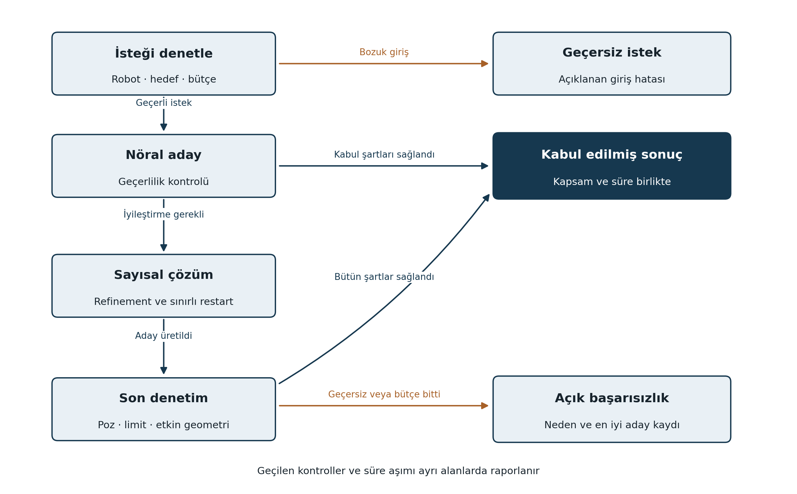

# NeuroKinematics Hybrid teknik tasarım raporu

Hedef yazılım v2.0.0 · Belge r1 · 17 Eylül 2026

## 1 Amaç ve mühendislik sorusu

Hybrid, nöral modelin başlangıç önerisini denetimli bir IK servisinin parçası haline getirir. Ana soru, aynı sayısal çözücü ve toplam kaynak bütçesinde öğrenilmiş başlangıcın iterasyon veya toplam süre kazancı sağlayıp sağlamadığıdır. Nöral çıktı hiçbir aşamada yalnız ağın ürettiği için geçerli kabul edilmez.

Faz; kabul politikası, bağımsız son doğrulama, sayısal refinement, sınırlı yeniden başlatma, yörünge değerlendirmesi, çözüm sonrası çarpışma denetimi ve ONNX Runtime hattını kapsar. Gerçek robot servo kontrolü, çarpışmadan kaçınan genel hareket planlayıcısı, tork kontrolü ve sertifikalı güvenlik işlevi bu sürümün teslimatı değildir.

| Gereksinim | Temel davranış | Kanıt |
|---|---|---|
| REQ-H01 | Her sonuçta açık geçerlilik ve hata nedeni | Kabul politikası testleri |
| REQ-H02 | Bütçeli refinement ve yeniden başlatma | Durum geçişi ve timeout kayıtları |
| REQ-H03 | Aynı çözücüde neural seed karşılaştırması | Eşleştirilmiş H1 deneyi |
| REQ-H04 | Zaman bilgili yörünge ve geometri analizi | Trajectory ve collision testleri |
| REQ-H05 | PyTorch–ONNX davranış eşliği | Diferansiyel runtime testi |
| REQ-H06 | Yeniden üretilebilir desteklenen servis | Model paketi ve G2 raporu |

Giriş koşulu G1 kapısının kapanmasıdır. Modelin düşük doğrudan başarı göstermesi H1 deneyini otomatik engellemez; eğitim ve değerlendirme zincirinin geçerli olması gerekir. Aday model, robot hash'i, normalizasyon ve çıktı yorumuyla birlikte devralınır.

### Literatür bağlantısı

Öğrenilmiş başlangıç kullanmak tek başına yeni bir kavram olarak sunulmaz. IKDiffuser'ın 2026 revizyonu, generatif modelin optimizasyon çözücülerini başlatmada kullanımını da ele alır [K10]. NeuroKinematics'in sınanacak farkı, seçilen seri robot ve iş yükündeki maliyet/başarı dengesi ile tekrarlanabilir servis hattıdır.

Bu rapor uygulama tasarımıdır. Hedef gecikme, doğruluk ve hata oranları henüz ölçülmemiştir. Her test ve performans şartı kendi konfigürasyonu ve kanıtıyla kapatılacaktır.

<!-- pagebreak -->

## 2 Sonuç sözleşmesi ve kabul akışı

`solve` isteği hedef poz, q_current, robot/model kimliği, toplam süre bütçesi ve doğrulama kapsamını içerir. Sonuç q_candidate, durum kodu, konum/yönelim hatası, limit kontrolü, tekillik metrikleri, çarpışma durumu, refinement/restart sayısı ve toplam süreyi içerir.

**Geometrik kabul:** Sonlu değerler, doğru boyut, eklem limitleri ve seçilen görev toleransı birlikte sağlanır. Varsayılan profil 2 mm / 1 derecedir; sıkı profil 1 mm / 0.5 derecedir. İki profil ayrı raporlanır. İç tolerans `joint_limit_epsilon=1e−8 rad` başlangıç sayısal yuvarlama payıdır; fiziksel limit genişletme değildir.

**Çarpışma kabulü:** İstek geometri denetimi gerektiriyorsa geometri yüklenmiş ve denetim yapılmış olmalıdır. `NOT_CHECKED` durumu `COLLISION_FREE` olarak gösterilmez. Tekillik yakınlığı ayrıca raporlanır; varsayılan statik IK kabulü tekil konfigürasyonu sırf bu nedenle yanlış geometri saymaz. Uygulama özel bir minimum tekil değer istiyorsa politika alanı olur.

**Zaman kabulü:** Geometrik olarak doğru fakat bütçe sonrasında dönen çözüm `LATE_VALID` olabilir; zamanında başarı olarak sayılmaz. Geç gelen alt görev sonucu iptal edilmiş isteği sonradan başarılı yapamaz. Bu politika Python veya işletim sisteminin hard real-time garantisi olduğu anlamına gelmez.

Sayısal motor da global yakınsama garantisi sağlamaz. Bütün denemeler başarısızsa açıklayıcı başarısızlık sonucu döner. Aynı deterministik ağı aynı girdilerle tekrar tekrar çalıştırmak alternatif arama sayılmaz.

<!-- pagebreak -->

## 3 Refinement ve hata sınıfları

Nöral öneri sonlu ve doğru boyutta ise önce bağımsız denetim yapılır. Geçerli sonuç doğrudan kabul edilir. Poz hatası yüksekse model önerisi DLS veya seçili LM varyantına seed olur. NaN veya bozuk çıktı varsa neural seed kullanılmaz; kalan bütçeyle q_current üzerinden sayısal başlangıç yapılır.

Limit dışında üretilen değer projection ile başlangıç aralığına alınabilir; bu işlem yalnız seed oluşturur. Projeksiyon hedef pozu değiştirebileceği için son çözüm FK ve bütün etkin kontrollerden yeniden geçirilir. Çarpışmalı sonuç, sınır içinde olduğu için kabul edilmez.

İlk politika en fazla bir neural-seeded refinement ve bir alternatif sayısal yeniden başlatmaya izin verir. Yeniden başlatma mevcut durum veya deterministik yedek seed kullanır. Her deneme baştan tam bütçe almaz; geçen ön işlem, neural inference ve doğrulama süresi ortak bütçeden düşülür. Deneme sayısı ve iterasyon tavanı configte sabittir.

| Durum kodu | Anlam | Yorum sınırı |
|---|---|---|
| INVALID_INPUT | Boyut, birim, quaternion veya sayı hatası | Çözüm aranmadı |
| MODEL_MISMATCH | Robot, TCP veya checkpoint kimliği farklı | Yanlış model kullanılmadı |
| KINEMATIC_VALID | Poz ve limit koşulları sağlandı | Çarpışmasızlık ayrıca bildirilir |
| COLLISION | Etkin geometri kontrolünde çarpışma | Alternatif çözüm olabilir |
| NOT_CONVERGED | Bütçede geçerli çözüm bulunmadı | Erişilemezlik kanıtı değildir |
| TIMEOUT | Süre veya iş bütçesi tükendi | Kaç deneme yapıldığı kaydedilir |
| PROVEN_UNREACHABLE | Analitik/sertifikalı dış sınır kanıtı var | Yalnız uygun kanıtla kullanılır |
| LATE_VALID | Geometri doğru, deadline kaçırıldı | Zamanında başarı değildir |

Bir sonuç birincil durum yanında çoklu tanı alanı taşıyabilir. Örneğin süre sonunda en iyi aday hem limit ihlali hem yüksek poz hatası içeriyorsa ikisi de saklanır. Başarısızlık analizi yalnız tek kodla bilgi kaybetmez.

### Güven ve geri dönüş politikası

Kabul kararı, kalibre edilmemiş bir neural confidence skoruna dayanmaz. Ölçülen FK artığı, limit ve geometri kontrolleri kullanılır. Öğrenilmiş belirsizlik kestirimi daha sonra eklenirse kalibrasyon verisi ve yanlış kabul oranı ayrıca sınanır. İstatistiksel güven, deterministik denetimin yerini almaz.

Refinement başarısızsa tüm sistemin doğru çözüm döndüreceği varsayılmaz. Servis açık başarısızlık üretebilen bir bileşendir. Fiziksel hareket kararı daha üst bir kontrol sistemine aittir; bu fazda çıktı offline analiz ve simülasyonda değerlendirilir.

<!-- pagebreak -->

## 4 H1 deneyi ve uçtan uca gecikme

H1 için sayısal algoritma, residual/Jacobian uygulaması, adım kabulü, tolerans, iterasyon tavanı ve toplam süre bütçesi aynıdır. Yalnız başlangıç politikası değişir. Öğrenilmiş başlangıcın hesaplanma süresi deneyden çıkarılmaz.

| Varyant | Seed | Kapsanan maliyet |
|---|---|---|
| B-H01 | q_current | Aynı sayısal çözüm ve son denetim |
| B-H02 | Sabit merkez konfigürasyonu | Aynı sayısal çözüm ve son denetim |
| B-H03 | Neural öneri | Ön işlem, NN, denetim ve sayısal çözüm |
| B-H04 | Bütçeli klasik restart | Bütün başlangıçlar ve denetimler |

<!-- equation:LATENCY -->
$$
T_{total}=T_{pre}+T_{NN}+T_{validate}+T_{numeric}+T_{post}
$$

Doğrulama zamanı, başlangıç ve son doğrulama ile etkin çarpışma kontrolünü kapsar. Alt süreler toplam süreyle karşılaştırılır; ölçüm ve orchestration farkı ayrıca saklanır. Model yükleme ve soğuk başlangıç ayrı ölçülür. GPU ölçümlerinde senkronizasyon ve host/device aktarımının dahil olup olmadığı açıkça yazılır.

10 ms ve 50 ms profilleri her yöntem için uygulanır. Batch=1, aynı CPU/thread kaynak tavanı ve aynı donanım ana profildir. En az 10.000 sabit sorgu, kaydedilmiş ısınma ve beş ölçüm geçişi kullanılır. Yöntem sırası etkisini azaltmak için sıra seed ile değiştirilir. Isınma örnekleri test modelini ayarlamak için kullanılmaz.

Her sorgunun P50/P95/P99 toplam süresi yanında iterasyon ve deadline kaçırma oranı incelenir. Aynı sorguyu beş kez ölçmek beş bağımsız hedef üretmez; güven aralığı hesaplarında sorgu/grup ve ölçüm tekrarı ayrılır.

<!-- equation:RATES -->
$$
r_{refine}=N_{refine}/N_{queries},\qquad r_{restart}=N_{restart}/N_{queries}
$$

Refinement, neural adayın sayısal olarak iyileştirilmesidir. Restart, başka seed ile yeni aramadır. Bu oranlar ayrı tutulur; önceki revize metindeki tek fallback oranı iki davranışı birleştiremez. Neural modelin doğrudan kabul oranı da ayrıca verilir.

**H1 proje hedefi:** Genel ana kümede P95 toplam sürede en az yüzde 20 azalma ve başarı oranında en fazla 1 yüzde puanı kayıp. Eşleştirilmiş yüzde 95 güven aralığı süre oranının 1'in altında olduğunu ve başarı farkının −1 yüzde puanından kötü olmadığını desteklemelidir. Hedef sağlanmazsa sonuç kapsamıyla raporlanır; model otomatik varsayılan yapılmaz.

<!-- pagebreak -->

## 5 Yörünge ve çarpışma değerlendirmesi

Yörünge, sıralı hedefler ve zaman damgaları içerir. Testte bir sonraki isteğin q_current değeri önceki **kabul edilmiş tahmin** olur. Her adımda gerçek etiket eklemini vererek teacher forcing yapmak, uçtan uca rollout sonucu sayılmaz. Bir adım başarısızsa davranış durdurma veya kontrollü yeniden başlatma olarak önceden tanımlanır.

İlk set en az 30 tam yörünge ve her birinde en az 200 zamanlı örnekten oluşur. FK ile üretilmiş bilinen uygulanabilir joint yörüngeleri ve ayrı Kartezyen hedef dizileri kullanılır. İkinci grupta her hedefin erişilebilir veya aradaki yolun geçerli olduğu varsayılmaz. Eğitim ve test yörüngeleri kimlik bazında ayrılır.

<!-- equation:JERK -->
$$
j_k\approx\frac{q_{k+3}-3q_{k+2}+3q_{k+1}-q_k}{\Delta t^3}
$$

Bu denklem eşit zaman aralıklı örnekler içindir. Değişken zaman damgasında uygun türev yaklaşımı veya belgelenmiş yeniden örnekleme kullanılır. Sınırlı eklemler yapay 2π sarmalamayla limit dışına taşınmaz. Türev hesaplarının uç nokta politikası ve birimleri raporlanır.

Konum farkı, hız, ivme, jerk RMS/tepe, jump sayısı, minimum ölçeklenmiş tekil değer ve maksimum koşul sayısı yörünge bazında verilir. Jump için varsayılan tanım, bir örnekte herhangi bir eklemin 0.2 rad üzerinde değişmesidir; üretici hız limitiyle çelişen hareketler ayrıca sayılır. Bu eşik bir kontrol güvenlik standardı değildir.

Jerk ölçümü varsayılan teslimattır; jerk kaybıyla yeniden eğitim opsiyonel deneydir. Aynı yolun daha yavaş yürütülmesi jerk değerini azaltabilir; yöntemler aynı zamanlama altında karşılaştırılır. Filtreleme veya zaman ölçekleme sonrasında poz takibi, limit ve geometri kontrolleri yeniden yapılır. Düşük jerk, mekanik ömür artışının ölçüldüğü anlamına gelmez.

### Geometri denetimi

Pinocchio geometri altyapısına uygun Coal/FCL ailesi adaptörü değerlendirilir; seçilen backend ve sürümü sabitlenir [K01, K16]. Visual mesh ile collision mesh ayrılır. İzin verilen temas çiftleri, mesh ölçekleri ve çevre koordinatları manifestte tutulur. Öz çarpışma ve çevre çarpışması ayrı kayıtlanır.

Tek poz kontrolü ile yol kontrolü farklıdır. Yol boyunca uçlar ve ara konfigürasyonlar denetlenir; örnekleme çözünürlüğü kaydedilir. Başlangıç çözünürlüğü en fazla 1 derece eklem değişimi ve 5 mm tahmini TCP değişimidir. Bu sonlu örnekleme ince engeller arasında çarpışmayı kaçırabilir; çıktı `SAMPLED_PATH_CHECK` olarak etiketlenir. Sürekli çarpışma garantisi verilmez. Geometri/süreklilik doğrulanamıyorsa yol uygunluğu `UNKNOWN` olur.

<!-- pagebreak -->

## 6 ONNX ve runtime doğrulaması

ONNX'e önce yalnız neural model ile tanımlı tensor ön/son işlemi aktarılır. Pinocchio denetimi, çarpışma motoru ve Python'daki fallback mantığının tamamının otomatik export edildiği varsayılmaz. Hibrit servis, exported neural bileşeni aynı host doğrulama katmanıyla kullanır.

Güncel PyTorch belgelerinde torch.export temelli ONNX akışı açıklanır [K15]. Uygulamada `dynamo=True`, desteklenen opset ve hedef ONNX Runtime sürümü doğrulanarak kilitlenir. Burada belirli bir sürümün kullanıcı bilgisayarında kurulmuş olduğu varsayılmaz.

| Test | Kapsam | Kabul hedefi |
|---|---|---|
| T-H01 | NaN, yanlış model, bozuk boyut, limit ve timeout | Yanlış başarı yok; tanı alanları tam |
| T-H02 | Neural iyi/kötü seed, refinement, restart | Geçişler ve toplam bütçe kaydı doğru |
| T-H03 | H1 seed deneyi | Adil protokol; sonuç ve güven aralığı mevcut |
| T-H04 | Zamanlı rollout ve türevler | Analitik sabit/hızlı polinom örnekleriyle türev kontrolü |
| T-H05 | En az 100 etiketli geometri örneği | Bilinen çarpışmalar kaçırılmıyor; bilinmeyen kapsam açıklanıyor |
| T-H06 | En az 1.000 PyTorch/ONNX girdi çifti | Ham eklem farkı ≤ 1e−5 rad hedefi; nihai doğrulama aynı |
| T-H07 | Temiz ortam ve servis tekrarı | Model paketi ve örnek sorgular çalışır |

ONNX kabulünde ayrıca FK çıktı farkı başlangıç hedefi 0.1 mm ve 0.01 derecedir. Eşik yakınındaki sınıflandırma farkları saklanır; final kabul her runtime'ın gerçek çıktısında bağımsız denetlenir. Büyük fark varsa model desteklenmeyen runtime olarak kalır. Sayısal farkı gizlemek için sadece ortalama hata verilmez.

FP16/INT8 ve TensorRT v2 için zorunlu değildir. FP32 CPU ONNX hattı kapanmadan bu optimizasyonlara geçilmez. Bunlar denenirse yeni model kimliği, doğruluk/limit denetimi ve gecikme ölçümü gerekir. ONNX hız kazancı sağlamasa da model taşıma ve bağımlılık azaltma sonucu ayrıca değerlendirilebilir.

### G2 kararı

Kritik servis testleri ve doğru başarısızlık davranışı zorunludur. H1 üstünlük hedefi sağlanırsa hybrid desteklenen varsayılan adaydır. Sağlanmazsa sayısal motor varsayılan kalır; nöral/hybrid seçenek araştırma modu olarak açık etiketlenebilir. ONNX başarısızsa nominal v2 teslimatı tamamlanmış sayılmaz; PyTorch destekli aday sürüm ve açık engel kaydı tutulur.

<!-- pagebreak -->

## 7 Roadmap ve Studio fazına devir

| Görev | Teslimat | Ön koşul |
|---|---|---|
| H2-01 Kabul ve hata politikası | SolverResult ve durum akışı | G1 |
| H2-02 Bütçeli hybrid | Refinement/restart servisi | H2-01 |
| H2-03 H1 deneyi | Seed karşılaştırması ve süre dağılımı | H2-02 |
| H2-04 Yörünge ve geometri | Rollout, türev ve collision raporu | H2-02 |
| H2-05 ONNX hattı | Export paketi ve runtime eşliği | H2-02 |
| H2-06 G2 ve dağıtım | Desteklenen motor kararı ve devir | H2-03, H2-04, H2-05 |

Etkin emek tahmini 90–140 saattir. H1 deneyi beklenen avantajı göstermiyorsa sonsuz hyperparameter araması yerine hata sınıfı başına en fazla iki hedefli düzeltme turu planlanır. Sonraki araştırma için ayrı kapsam açılır; Studio'nun güvenilir sayısal servisle ilerleyebilmesi korunur.

Studio'ya SolverRequest/Result sözleşmesi, robot ve model manifestleri, ham deney kayıtları, desteklenen runtime, geometri kontrol kapsamı, örnek yörüngeler ve başarısızlık görselleştirme gereksinimleri devredilir. GUI kendi kabul eşiğini veya ikinci bir FK uygulamasını yaratmaz.

### Kalan belirsizlikler

Mevcut bilgisayarın performansı, kullanılacak geometri varlıklarının kalitesi, gerçek hız/ivme/jerk limitlerinin erişilebilirliği ve export desteği uygulama sırasında doğrulanacaktır. Üretici ivme/jerk sınırı yoksa deneysel profil açıkça `EXPERIMENTAL_LIMITS` olarak işaretlenir; fiziksel çalışma uygunluğu iddia edilmez. Bu eksik bilgi, kinematik araştırmayı durdurmaz fakat hareket uygulanabilirliği yorumunu sınırlar.

## 8 Kaynaklar

K01 [Pinocchio resmi depo ve geometri altyapısı](https://github.com/stack-of-tasks/pinocchio).

K10 [Zhang ve Jiao IKDiffuser v4](https://arxiv.org/abs/2506.13087v4), 14 Ocak 2026 revizyonu; ön baskı. Öğrenilmiş başlangıç karşılaştırmasının ilgili literatürüdür.

K15 [PyTorch ONNX export belgeleri](https://docs.pytorch.org/docs/2.14/onnx.html). Bu URL, inceleme sırasında açılan belge sürümüdür; proje ortamına aynı sürümü kurma taahhüdü değildir.

K16 [Coal resmi geometri kütüphanesi](https://github.com/coal-library/coal). Backend seçimi ve paket sürümü H2-04 içinde uyumluluk deneyiyle sabitlenir.

Kaynak erişimi 17 Eylül 2026. Bu raporda gerçek robot deney sonucu yoktur. Görev ayrıntıları `docs/roadmaps/H2_Hybrid.md`, sonuç durumu `docs/records/STATUS.md` içinde izlenir.
